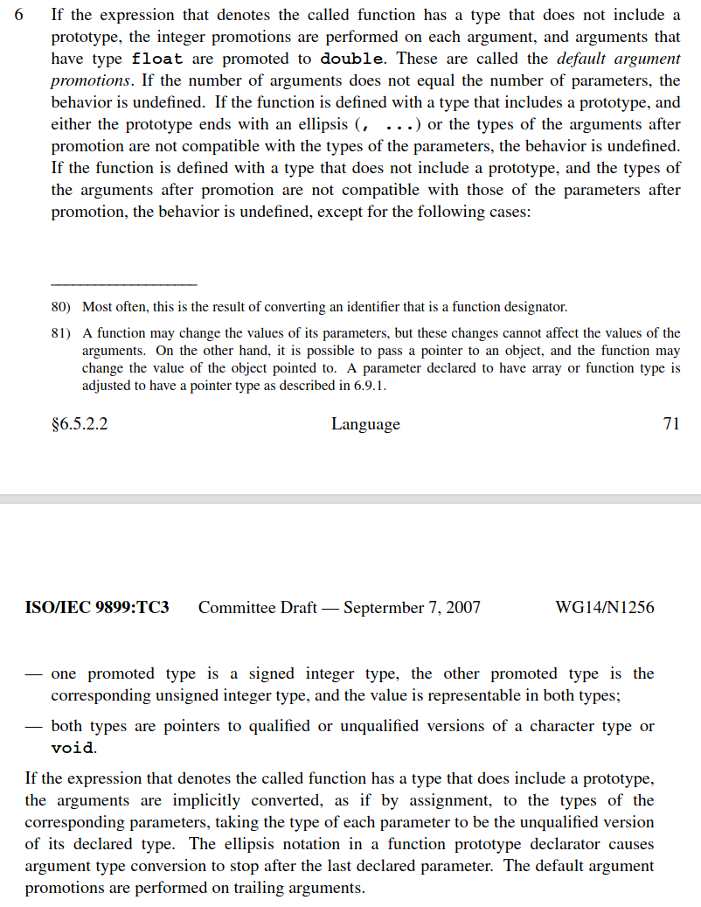

## What's News

Last night in Washington, DC this year's winners of the [International Obfuscated C Code Contest](https://www.ioccc.org/)were hosted by the current administration and treated to a formal dinner in the White House. During the dinner, the winners reached a historic pact with the Recognizing Testing Functions Matters (RTFM) Union by agreeing to stop torturing their compilers in exchange for a break on having to write so many unit tests.

## Formal Program Semantics

Formally specifying the syntax of a programming language can only take us so far along the path of understanding the meaning of a program. Regular expressions, tokenizers, lexemes, context-free grammars, and parsers are the tools at our disposal for learning about a program's syntax. Unfortunately, when we limit ourselves to analyzing a program in terms of a context-free grammar there are certain aspects of a program that we _should_ be able to analyze statically that we cannot (because, well, they require context to analyze). So, we extended our discussion of syntax formalisms by discussing _static semantics_. That may seem like an oxymoron -- determining the meaning of a statement by looking only at the _syntax_ (the _very_ thing that _only_ specifies the _form_ of a valid program)? Nevertheless, it's possible (to an extent) using _attribute grammars_.

The formal tools that we used to analyze the syntax and form of a program are relatively standardized. On the other hand, there is less of a consensus about how a program language designer formally describes the _dynamic semantics_, the meaning of a program when it is executed, of programs written in their language. The codification of the semantics of a program written in a particular is known as _formal program semantics_. In other words, formal program semantics are a  precise mathematical description of the semantics of an executing program.​ Sebesta uses the term _dynamic semantics_ which he defines as the "meaning[] of the expressions, statements and program units of a programming language." 

The goal of defining formal program semantics is to understand and reason about the behavior of programs. There are many, many reasons why PL designers want a formal semantics of their language. However, there are two really important reasons: With formal semantics it is possible to prove that

1.  two programs calculate the same result (in other words, that two programs are equivalent), and
2.  a program calculates the correct result.

The alternative to formal program semantics are _standards_ promulgated by committees that use natural language to define the meaning of program elements. Here is an example of a page from the standard for the C programming language:



If you are interested, you can find the [C++ language standard](https://isocpp.org/std/the-standard), the [Java language standard](https://docs.oracle.com/javase/specs/), the [C language standard](http://www.open-std.org/jtc1/sc22/wg14/), the [Go language standard](https://golang.org/ref/spec) and the [Python language standard](https://docs.python.org/3/reference/) all online.

## Testing vs Proving

There is absolutely a benefit to testing software. No doubt about it. However, testing that a piece of software behaves a certain way does not prove that it operates a certain way.

_"Program testing can be used to show the presence of bugs, but never to show their absence!" - [Edsger Dijkstra​](https://en.wikipedia.org/wiki/Edsger_W._Dijkstra)_

There is an entire field of computer science known as formal methods whose goal is to understand how to write software that is provably correct. There are systems available for writing programs about which things can be proven. There is [PVS](https://pvs.csl.sri.com/), [Coq](https://coq.inria.fr/), [Isabelle](https://isabelle.in.tum.de/doc/tutorial.pdf), and [TLA+](https://lamport.azurewebsites.net/tla/tla.html), to name a few. PVS is used by NASA to write its mission-critical software and it even makes an appearance in the movie [The Martian](https://shemesh.larc.nasa.gov/fm/pvs/TheMartian/).

### Three Types of Formal Semantics

There are three common types of formal semantics. It is important that you know the names of these systems, but we will only focus on one in this course!

1.  Operational Semantics: The meaning of a program is defined by how the program executes on an idealized virtual machine.
2.  Denotational Semantics: Program units "denote" mathematical functions and those functions transform the mathematically defined state of the program.
3.  Axiomatic Semantics: The meaning of the program is based on proof rules for each programming unit with an emphasis on proving the correctness of a program.

Again, we will only focus on one of the styles, operational semantics.

## Operational Semantics

### Program State

We have referred to the state of the program throughout this course. We have talked about how statements in imperative languages can have side effects that affect the value of the state and we have talked about how the assignment statement's raison d'etre is to change a program's state. Because of the central role that the state plays in the meaning of an imperative programming language, we have to very precisely define a program's state.

At all times, a program has a state. A state is just a function whose domain is the set of _defined_ program variables and whose range is $V \times T$ where $V$ is the set of all valid variable values (e.g., `5`, `6.0`, `True`, `"Hello"`, etc) and $T$ is the set of all valid variable types (e.g., $Integer$, $Floating Point$, $Boolean$, $String$, etc). ​In other words, you can ask a state about a particular variable and, if it is defined, the function will return the variable's current value and its type.

The state of a program is abbreviated with the $\sigma$. Again, $\sigma$ is just a function, so we can _call_ it:

$$
\sigma(x) = (v, \tau)
$$

you can read the definition above as "Variable _x_ has value $v$ and type $\tau$ in state $\sigma$. $\tau$ always represents some arbitrary variable type. Generally, $v$ represents a value.

## Program Configuration

Between execution _steps_ (a term that we will define shortly), a program is always in a particular _configuration_:

$$
<e,\sigma>
$$

This means that the program in state $\sigma$ is _about to_ evaluate expression $e$. Note well that the configuration describes the expression that is next to be evaluated -- it has not yet been evaluated. You can think of it like the debugger stopped on a particular statement/expression -- that will be the _next_ thing to execute.

## Program Steps  

A program step is an atomic (indivisible) change from one program configuration to another. Operational semantics defines steps using rules. The general form of a rule is

$$
\frac{premises}{conclusion}
$$

The conclusion is generally written like

$$
<e, \sigma> \longrightarrow <v, \tau, \sigma'>
$$

This statement is the _evaluation relation_ of a rule. The rule defines that, when the premises hold, the program configuration $<e,\sigma>$ evaluates to a value ($v$), type ($\tau$) and (possibly modified) state ($\sigma'$)  after a single step of evaluation. Note that rules _do not_ yield configurations. All this will make sense when we see an example.

**Example 1: _Defining the semantics of variable access._**

In STIMPL, the expression to access a variable, say _i_, is written like `Variable("i")`. Our operational semantics rule for _evaluating_ such an access should "read" something like: 

> When the program is about to execute an expression to access variable $i$ in a state $\tau$, the value of the expression will be the triple of $i$'s value and type (in the current state) and that state $\sigma$, unchanged.

In other words, without disturbing the program's current state, the evaluation of the next step of a program that is about to access a value is the value and type of the variable being accessed. To reiterate, accessing a variable _does not_ change the value of the program's state.

Let's write that formally!

$$
\frac{\sigma(x)\longrightarrow(v,\tau)}{<Variable(x),\sigma>\longrightarrow(v,\tau,\sigma)}
$$

What, exactly, does this mean? Let's look at the premises. The premises are (partly) responsible for determining whether a rule defines the semantics of a program's step.

The premises here say that one of the conditions that determines whether this rule is applicable is that variable $x$ has value $v$ and type $t$ in state $\sigma$. Because our premise includes variables ($v$ and $\tau$), the premises are irrefutable (remember that term from the Python Pattern discussion?). In other words, this premise is really just a means for us to give a symbol to the variable's type and value in a way that we can use in the conclusion of our rule.

Well, what other piece of the rule defines whether it is the applicable rule defining the next step? The left side of the $\longrightarrow$! The other part of the requirement for "choosing" this rule's semantics as the description of the next step is that the program is in state $\sigma$ and the next expression to execute is $Variable(x)$. When *both* of those hold, this is the rule that defines the next step!

Now, let's look on the right side of the $\longrightarrow$ to decipher the evaluation result specified by this rule. We see that the result of looking up variable $x$ in state $\sigma$ is just that variable's value, it's type and an unchanged state!

Why are we able to carry the existing state across the program step? Because simply accessing a variable will not have an impact of the state! How cool is that?

#### State Update

How do we write down a change to the state? Why would we want to change the state? Let's answer the second question first: we want to change the state when, for example, there is an assignment statement. If $\sigma(i)= (4, Integer)$ and then the program evaluated an expression like `Assign(Variable("i"), IntLiteral(2))`, we don't want the $\sigma$ to return $(4, Integer)$ any more! We want it to return $(2, Integer)$. We can define that mathematically like:


$$
\sigma \lbrack (v,\tau) / x \rbrack(y) = \begin{cases}
\sigma (y) &  y \ne x \\
(v, \tau) & y = x
\end{cases}
$$

This function definition means that if you are querying the updated state for the variable that was just reassigned ($x$), then return its new value and type ($m$ and $\tau$). Otherwise, just return the value that you would get from accessing the existing state of the program _before_ the update! 

> Note: Can you see now why we are implementing the state function in the "odd" way that we described in class? The code that we wrote in Python is almost _exactly_ what the mathematical function (above) specifies! Prove it to yourself!

**Example 2: _Defining the semantics of variable assignment (for a variable that already exists)._**

In STIMPL, the expression to overwrite the value of an existing variable, say _i_, with, say, an integer literal 5 is written like `Assign(Variable("i"), IntLiteral(5))`. Our operational semantic rule for _evaluating_ such an assignment should "read" something like: 

> When the program is about to execute an expression to assign variable _i_ to the integer literal 5 in a state $\sigma$ and the type of the variable _i_ in state $\sigma$ is $Integer$, the value of the expression will be the triple of $5, Integer$ and the changed state $\sigma'$ which is exactly the same as state $s\sigma$  except where $(5, Integer)$ replaced _i_'s earlier contents."

That's such a mouthful! But, I think we got it. Let's replace some of those literals with symbols for abstraction purposes and then write it down!

$$
\frac{<e,\sigma>\longrightarrow\left(v,\tau,\sigma'\right),\sigma'\left(x\right)\longrightarrow\left(*,\tau\right)}{<Assign\left(Variable\left(x\right),e\right),\sigma>\longrightarrow\left(v,\tau,\sigma'\left[\left(v,\tau\right)/x\right]\right)}
$$

Let's look at it step-by-step:

$$
<Assign(Variable(x), e), \sigma>
$$

is the configuration and means that we are about to execute an expression that will assign the value of expression _e_ to variable _x_. But what is the value of expression _e?_ The premise

$$
<e, \sigma> \longrightarrow (v, \tau,\sigma')
$$

tells us that this rule only applies when the value and type of _e_ when evaluated in state $\sigma$ is $v$, and $\tau$. Moreover, the premise tells us that the rule only applies when the state may have changed during evaluation of expression _e_ and that subsequent evaluation should use a new state, $\sigma'$. Our mouthful above had another important caveat: the type of the value to be assigned to variable _x_ must match the type of the value already stored in variable _x_. The second premise

$$
\sigma'(x) \longrightarrow (*, \tau)
$$

tells us that the type of the expression's value and the type of variable _i_ match -- see how the $\tau$s are the same in the two premises? (We use the $*$ to indicate that the applicability of this rule is not predicated on the variable's value, just its type!).

Now we can just put together everything we have and say that the expression assigning the value of expression _e_ to variable _x_ evaluates to

$$
(v,\tau,\sigma'[v,\tau)/x])
$$

You did it!!

## That's Great, But Show Me Code!

Well, Will, that's fine and good and all that stuff. But, how do I _use_ this when I am implementing STIMPL? I'll show you! Remember the operational semantics for variable access:

$$
\frac{\sigma(x)\longrightarrow(v,\tau)}{<Variable(x),\sigma>\longrightarrow(v,\tau,\sigma)}
$$

Compare that with the code for it's implementation in the STIMPL skeleton that you are provided for Assignment 2:

```Python
def evaluate(expression, state):  
...

    case Variable(variable_name=variable_name):
      value = state.get_value(variable_name)
      if value == None:
        raise InterpSyntaxError(f"Cannot read from {variable_name} before assignment.")
      return (*value, state)
```
At this point in the code we are in a function named `evaluate` whose first parameter is the next expression to evaluate and whose second parameter is a state. Does that sound familiar? That's because it's the same as a _configuration_! We use _pattern matching_ to select the code to execute. The pattern is based on the structure of the `expression` variable and we match in the code above when `expression` is a variable access. Refer to [Pattern Matching in Python](TODO) for the exact form of the syntax. The `state` variable is an instance of the `State` object that provides a method called `get_value` (see [Assignment 2: Implementing STIMPL](TODO) for more information about that function) that returns a tuple of $(v, \tau)$. In other words, `get_value` works the same as $\sigma$. So,

```Python
      value = state.get_value(variable_name)
```
is a means of carrying out the premise of the operational semantics.
```Python
      return (*value, state)
```
yields the final result! Pretty cool, right?

Let's do the same analysis for assignment:

$$
\frac{<e,\sigma>\longrightarrow\left(v,\tau,\sigma'\right),\sigma'\left(x\right)\longrightarrow\left(*,\tau\right)}{<Assign\left(Variable\left(x\right),e\right),\sigma>\longrightarrow\left(v,\tau,\sigma'\left[\left(v,\tau\right)/x\right]\right)}
$$

And here's the implementation:

```Python
def evaluate(expression, state):
...

   case Assign(variable=variable, value=value):

      value_result, value_type, new_state = evaluate(value, state)

      variable_from_state = new_state.get_value(variable.variable_name)
      _, variable_type = variable_from_state if variable_from_state else (None, None)

      if value_type != variable_type and variable_type != None:
        raise InterpTypeError(f"""Mismatched types for Assignment: 
            Cannot assign {value_type} to {variable_type}""")

      new_new_state = new_state.set_value(variable.variable_name, value_result, value_type)
      return (value_result, value_type, new_new_state)
```

First, look at

```Python
      value_result, value_type, new_state = evaluate(value, state)
```

which is how we are able to find the values needed to satisfy the left-hand premise. `value_result` is $v$, `value_type` is $\tau$ and `new_state` is $\sigma'$'.

```Python
      variable_from_state = new_state.get_value(variable.variable_name)
```
is how we are able to find the values needed to satisfy the right-hand premise. Notice that we are using `new_state` ($\sigma'$) to get `variable.variable_name` ($x$). There is some trickiness in
```Python
      _, variable_type = variable_from_state if variable_from_state else (None, None)
```

to set things up in case we are doing the first assignment to the variable (which sets its type), so ignore that for now! Remember that in our premises we guaranteed that the type of the variable in state $\sigma$' matches the type of the expression:

```Python
      if value_type != variable_type and variable_type != None:
        raise InterpTypeError(f"""Mismatched types for Assignment: 
            Cannot assign {value_type} to {variable_type}""")
```

performs that check!

```Python
      new_new_state = new_state.set_value(variable.variable_name, value_result, value_type)
```

generates a new, new state ($\sigma'[(v,\tau/x])$) and

```Python
      return (value_result, value_type, new_new_state)
```

yields the final result!

## From Theory to Code and Back Again

Now that we have explored how we write down operational semantics for certain constructs and then compared the implementation of an interpreter that evaluates the actual constructs in a living, breathing language, I hope that it is obvious how one leads easily to another. The operational semantics are, in a sense, a mathematically rigorous form of pseudocode. In fact, that pseudocode is _so_ similar to the code that we write in the implementation of the interpreter, it's almost a mechanical translation process between the two.