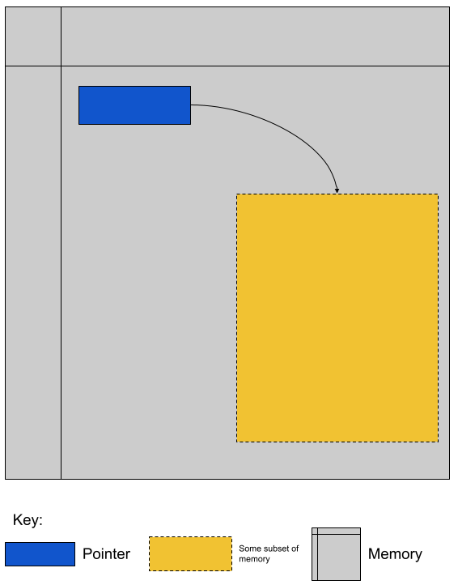
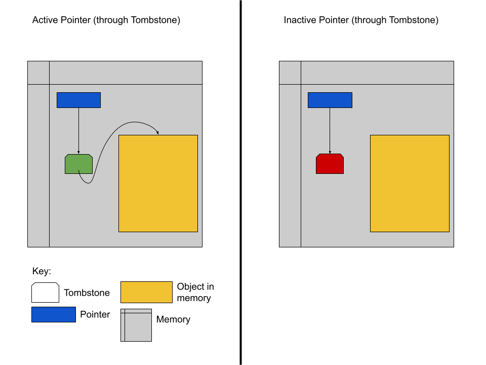

## What's News

This Thanksgiving, NBC will air the [National Dog Show](https://www.nbc.com/nbc-insider/2024-national-dog-show). The books have all published their opening lines: The odds-on favorite for Best In Show is a short-haired pointer named [Tony](https://www.infoq.com/presentations/Null-References-The-Billion-Dollar-Mistake-Tony-Hoare/).

## Pointers

Although we programmers tend to freak out when we hear the word "pointer", it is comforting to recall that pointers are like any other type -- they have a range of valid values and a set of valid operations that you can perform on those values. What are the range of valid values for a pointer? All valid memory addresses (but see below). And what are the valid operations? Creation, addition, subtraction, dereference, and assignment (Note: the specific operations that are available for pointers may differ between languages).

In the diagram, the gray area is the memory of the computer. The blue box is a pointer. It points to the gold area of memory.

> To keep things from getting repetitive, we may also say that a pointer "targets" a piece of memory or that a pointer has a "target".

It is important to remember that pointers and their targets _both_ exist in memory! In fact, in true [Inception](https://www.imdb.com/title/tt1375666/) style, a pointer can point to a pointer! If the programmer _dereferences_ a pointer, they are accessing the memory targeted by that pointer. 

In some languages, pointers are used primarily to point to untyped _memory cells_, areas of a computer's memory. In these languages, the programmer gets no support in determining the type of the contents of the memory at a pointer's target.

In other languages, it is possible to think of pointers "having" types. In languages like these, the programmer is guided into thinking that pointers always target places in memory that actually hold variables. It is for this reason that the type of pointers in languages such as these need longer names. For example, if the gold box held an object of type `T`, then the pointer stored in the blue box would have type "pointer to type `T`." In these languages, it would be ideal if the type of the pointer and the type of the variable stored at the target of the pointer are the same.  However, that's not always the case.

When we were discussing the nature of the _type_ of pointers, we specified that the range of valid values for a pointer are all memory addresses. In some languages this may be true. However, some other languages specify that the range of valid values for a pointer are all memory addresses _and_ a special _null_ value that can be used to explicitly signal that a pointer does not point to a target.

Like any other type in a programming language, a certain set of operations can be performed on pointers. We discussed already the _dereference_ operation. In some languages it is possible to _add_ and _subtract_ pointer variables (with different results in different languages). Certainly it is the case that you can _(re)assign_ pointers to target different pieces of memory. 

The only operation that we have failed to discuss so far is the operation that helps us "create" pointer targets. After all, we don't want to just guess where in the computer's vast memory is the region we want to target. That is the _creation_ operation. In C/C++, the `&` operator can be used to get the address of a variable in memory which can be assigned to a pointer. In other words, the _address of_ operator in C/C++ gives us the power to precisely specify the region in the computer's memory where we want a pointer to target.

## The Pros of Pointers

Though a very [famous and influential computer scientist](https://en.wikipedia.org/wiki/Tony_Hoare) once called his invention of _null references_ a "billion dollar mistake" (he low balled it, I think!), the presence and power of pointers in a language is important for at least two reasons:

1.  Without pointers, the programmer could not utilize the power of indirection.
2.  Pointers give the programmer the power to address and manage heap-dynamic memory.

_Indirection_ gives the programmer the power to link between different objects in memory -- something that makes writing certain data structures (like trees, graphs, linked lists, etc) easier. Management of heap-dynamic memory gives the programmer the ability to allocate, manipulate and deallocate memory at runtime. Without this power, the programmer would have to know _before execution_ the amount of memory their program will require. Although memory allocation at runtime seems initially like just a neat parlor trick, there are certain applications that cannot be written without it. Remember the criticism of Pascal from Brian Kernighan that we discussed? Brian lamented the fact that there is no dynamic allocation of strings. As a result, he said, he was forced to make some nasty choices and build sloppy workarounds.

## Heap-Dynamic Memory: A Digression

We have talked on more than one occasion about the _stack_ and its utility in providing space for a local variable during that variable's lifetime. We have talked less (but have mentioned it, at least!) about the memory used to store static variables during the lifetime of those variables. But we have not talked at all about the memory used to store heap-dynamic variables during their lifetime.

Given the term, it seems obvious that the storage for those variables will be in the heap. But just what is the heap? In a modern multiprocessing operating system with _virtual memory_, each program believes that it has complete access to the _entire_ memory of the computer. In a sense it is right and in a sense it is woefully wrong!

The operating system stage stages that illusion to make programmers' lives easier. So, we'll suspend disbelief, too, and go with the illusion. You learned that that stack (the memory region and not the data structure) is both the place with storage for stack-local variables and the stack frames themselves and it grows down. Even though our programs don't have to coexist (knowingly) with other user applications, every process must make space for the kernel. Therefore, the kernel must exclusively own some space in memory so that it can continue to always be executing. That explains most of the figure below.

.png)

The only remaining item to locate is the Heap. The Heap is memory (and an area of memory) that exists on the opposite end of the address space from the stack. It grows in the opposite direction (as the operating system allocates pieces of it to programs/programmers for their use). Memory that is _dynamically allocated_ while the program is executing comes from the heap (almost exclusively!). It is memory in this area that pointers are most often used to address. Memory in the heap is dynamically allocated to user programs by the kernel on demand. The programmer uses an API provided by the language (or the system) in order to ask the operating system for the exclusive rights to a certain subset of the computer's memory. Pointers target the allocated resources and the programmer can use that pointer to update the memory targeted by that pointer or release it back to the system for other programs to use.

## The Cons of Pointers

Their use as a means of indirection and heap-dynamic memory management are powerful, but misusing either can cause serious problems.

### Possible Problems when Using Pointers for Indirection

As long as a pointer targets memory that contains the expected type of object, everything is a-okay. Problems arise, however, when the target of the pointer is an area in memory that does not contain an object of the expected type (maybe even garbage) and/or the pointer targets an area of memory that is inaccessible to the program (for any reason).

The former problem can arise when code in a program writes to areas of memory beyond their control (this behavior is usually an error, but is very common). It can also arise because of a _use after free_ error. As the name implies, a use-after-free error occurs when a programmer uses memory after it has been freed (brilliant, I know). There are two common scenarios that give rise to a use-after-free error:

1.  Scenario 1:
    1.  The three parts (part (A), (B) and (C)) of a complete program all have pointers to the _same_ area of memory
    2.  Part A frees an area of memory that held a variable of type `T` that it no longer needs
    4.  Part C overwrites that "freed" area of memory with a variable of type `S`
    5.  Part B accesses the memory assuming that it still holds a variable of Type `T`
2.  Scenario 2:
    1.  The two parts (part (A) and (B)) of a complex program each have a pointer to the same place in memory
    2.  Part A frees an area of memory that held a variable of type `T` that it no longer needs
    3.  Part A never nullifies the pointer it used to point to that area of memory though the pointer is now invalid because the program has released the space
    4.  Part C overwrites that "freed" area of memory with a variable of type `S`
    5.  Part A incorrectly accesses the memory using the invalid pointer assuming that it still holds a variable of Type `T`

Scenario 2 is depicted visually in the following scenario and intimates why use-after-free errors are considered security vulnerabilities:

In the example above, the program's use of the invalid pointer means that the user of the invalid pointer can now access an object that is at a higher privilege level (Restricted vs Regular) than the programmer intended. When the programmer calls a function through the invalid pointer they expect that a method on the Regular object will be called. Unfortunately, a method on the Restricted object will be called instead. Trouble!

The problem of a programmer's use of a pointer to memory beyond their control is equally as troublesome. This situation most often occurs when the program sets a variable's address to the special value that indicates the _absence_ of value (e.g., `NULL`, `null`, `nil`) to indicate that it is invalid but later uses that pointer without checking its validity. For compiled languages, this often results in the dreaded _segmentation fault_ and for interpreted languages it often results in other anomalous behavior (like Java's _Null Pointer Exception (NPE)_). Neither are good!

### Possible Solutions

Wouldn't it be nice if we had a way to make sure that a pointer being dereferenced is valid so we don't fall victim to some of the aforementioned problems? What would be the requirements of such a solution?

1.  Pointers to areas of memory that have been deallocated cannot be dereferenced.
2.  The type of the object at the target of a pointer always matches the programmer's expectation.

Sebesta describes two potential solutions that meet these requirements. First, are tombstones.

Tombstones are essentially an intermediary between a pointer and its target. When the programming language implements pointers with tombstones for protection, it allocates a new tombstone for each pointer the programmer generates. The programmer's pointer targets the tombstone and the tombstone targets the pointer's actual target. The tombstone also contains an extra bit of information: whether it is valid. When the programmer first instantiates a pointer to some target _a_, the compiler/interpreter

1.  generates a tombstone whose target is _a_
2.  sets the valid bit of the tombstone to _valid_
3.  points the programmer's pointer to the tombstone.

When the programmer dereferences their pointer (in an attempt to access the memory at its target), the compiler/runtime will check to make sure that the target tombstone's valid flag is set before doing anything else. 

The compiler/interpreter guarantees that when the programmer "destroys" a pointer (by releasing the memory at its target or by some other means), the target tombstone's valid flag is set to invalid. As a result, if the programmer later attempts to dereference the pointer after it was destroyed, the compiler/runtime will see that the tombstone's valid flag is invalid and generate an appropriate error.

This process is depicted visually in the following diagram.

This seems like a great solution! Unfortunately, there are downsides. In order for the tombstone to provide protection for the duration of the program's execution, once a tombstone has been allocated to protect a particular pointer, it cannot be reclaimed. It must remain in place forever because it is always possible that a programmer can incorrectly reuse an invalid pointer _sometime real soon now_. As soon as the tombstone is deallocated, the protection that it provides is gone. The other problem is that the use of tombstones adds an additional layer of indirection to dereference a pointer and every indirection causes memory accesses. Though memory access times are small, they are not zero -- the cost of these additional memory accesses add up and ultimately significantly affects program performance (especially programs that perform large amounts of I/O).

What about a solution that does not require an additional level of indirection? There is a so-called lock-and-key technique. This protection method requires that the pointer hold an additional piece of information beyond the address of the target: the key. The memory at the target of the pointer is also required to hold a key. When the system allocates memory it sets the keys of the pointer and the target to be the same value. When the programmer dereferences a pointer, the two keys are compared and the operation is only allowed to continue if the keys are the same. The process is depicted visually below.

With this technique, there is no additional memory access -- that's good! However, there are still downsides. First, there is a speed cost. For every dereference there must be a check of the equality of the keys. Depending on the length of the key, that can take a significant amount of time. Second, there is a space cost. Every pointer and block of allocated memory now must have enough space to store the key in addition to storing the value. For systems where memory allocations are done in big chunks, the relative size overhead of storing, say, an 8 byte key is not significant. However, if the system allocates many small areas of memory, the relative size overhead is tremendous. Moreover, the more heavily the system relies on pointers, the more space will be used to store keys rather than meaningful data.

Well, let's just make the keys smaller? Great idea. There's only one problem: The smaller the space reversed to hold the keys, the fewer unique key values. Fewer unique key values mean that it is more likely an invalid pointer randomly points to a chunk of memory with a matching key ([pigeonhole principle](https://en.wikipedia.org/wiki/Pigeonhole_principle)). In this scenario, the protection afforded by the scheme is vitiated. (I just wanted to type that word -- I'm not even sure I am using it correctly!)