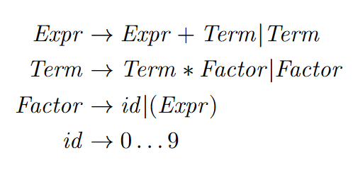

### What's News

Long thought to have been driven apart forever by deep creative differences, HaLL(1) and $Oate\Sigma$ are heading out on a reunion tour. 

### Peanut Butter and Jelly

Like Hall and Oates, Peanut Butter and Jelly and Pizza and Pineapple, when you put together two great things, amazing happens. That's what we are going to do today by combining the power of context-free grammars and recursion to explore a technique that allows us to (relatively) mechanically translate a grammar into a parser for sentences in the language described by that grammar.

To reiterate, the goal of a parser is to convert the source code for a program into a parse tree. The syntax of the language in which the program is written is specified in a context-free grammar. Parsing occurs in two parts: lexical analysis and syntax analysis. The lexical analyzer converts the program's source code (in the form of bytes on disk) into a sequence of tokens. The syntax analyzer, the subject of this Daily PL issue, turns the sequence of tokens (produced by the _tokenizer_) into a parse tree. The lexical analyzer and the syntax analyzer go hand-in-hand: As the syntax analyzer goes about its business of creating a parse tree, it will periodically turn to the lexical analyzer and say, "Give me the next token!".

There are straightforward algorithms for building a lexical analyzer directly from the language's CFG. It would be great if we had something similar for the syntax analyzer. In fact, there are _many_ such algorithms, some more general than others. We are going to explore just one of the many techniques for converting a CFG into code that will build an actual parse tree. If you take a course in compiler construction you will see the other techniques defined in detail. We only have time to cover one particular technique for translating a CFG into code that constructs parse trees and it only works for a subset of all grammars.

Those caveats make it seem as if the _recursive descent parser_ is _not_ powerful. On the contrary. It is powerful and easy to use. In your career, you will _absolutely_ write a recursive descent parser.

Let's dig in to the details!

### Descent Into Madness

A _recursive-descent parser_ is a type of parser that can be written directly from the structure of a CFG -- as long as that CFG meets certain constraints. In a recursive descent parser built from a CFG $G$, we will write a subprogram for every nonterminal in $G$ whose job it will be to turn the sequence of upcoming tokens into a node in the parse tree that represents that nonterminal. Because non-terminals are oftentimes defined in term of other non-terminals, most of these subprograms will be recursive. A recursive-descent parser builds a parse tree from the top down, meaning that it begins with $G$'s start symbol and attempts to build a parse tree that represents a valid derivation whose final sentential form matches the program's tokens. There are other parsers that work bottom up, meaning that they start by analyzing a sentential form made up entirely of the program's tokens and attempt to build a parse tree that "reduces" to the grammar's start symbol. Give that the subprograms are _recursive_ and that the parse tree is built _top down_, the recursive-descent parser is aptly named.

We mentioned before that there are limitations on the types of languages that can be parsed with recursive-descent parsers. In particular, recursive-descent parsers can only recognize _LL_ grammars. _LL_ grammars are grammars whose parse trees represent a leftmost derivation and can be built from a single left-to-right scan of the input tokens. To be precise, the first _L_ represents the left-to-right scan of the input and the second L indicates that the parser generates a leftmost derivation. There is usually another restriction -- a limit on the number of lookahead tokens available. A lookahead token is the _next_ token that the lexical analyzer will return as it scans through the input. The parser uses lookahead tokens to make decisions about which of the non-terminals it should try to parse next.Limiting the number of lookahead tokens reduces the memory requirements of the syntax analyzer but restricts the types of languages that those syntax analyzers can recognize. The number of lookahead tokens is written after LL and in parenthesis. _LL(1)_ indicates 1 token of lookahead. We will see the practical impact of this restriction later in this edition.

All of these words probably seem very arbitrary, but I think that an example will make things clear!

### Old Faithful

Let's return to the grammar for mathematical expressions that we have been examining throughout this module:



We will assume that there are appropriately named tokens for each of the terminals (e.g, the `)` token is `CLOSE_PAREN`) and that any numbers are tokenized as `ID` with the lexeme set appropriately.

According to the definition of a recursive-descent parser, we want to write a (possibly recursive) subprogram for each of the non-terminals in the grammar. The job of each of these subprograms is to parse the upcoming tokens into a parse tree that matches the non-terminals. For example, the (possibly recursive) subprogram for _Expr_, `Expr`, parses the upcoming tokens into a parse tree for an expression and returns that parse tree. To facilitate recursive calls among these subprograms, each subprogram returns the root of the parse tree that it builds. The parser begins by invoking the subprogram for the grammar's start symbol. The return value of that function call will be the root node of the parse tree for the entire input expression. Any recursive calls to other subprograms from within the subprogram for the start symbol will return _parts_ of that overall parse tree.

I am sure that you see why each of the subprograms usually contains some recursive function calls -- the non-terminals themselves in the grammar for which we are building a parser are defined recursively.

How would we write such a (possibly recursive) subprogram to build a parse tree rooted at a $Factor$ from a sequence of tokens? 

There are two productions for a $Factor$ so the first thing that the `Factor` subprogram does is determine whether it is parsing, for example, (5+2) -- a parenthesized expression -- or 918 -- a simple `ID`. In order to differentiate,  we would write the `Expr` function to simply consult the (one) lookahead token. If, upon invocation, the lookahead token is an `OPEN_PAREN`, then we should write the function to work like we did when we evaluated the production $Factor \rightarrow ( Expr ) $. On the other hand, if the lookahead token is an `ID`, then we should write the function to work like we worked evaluating the production $Factor \rightarrow id$. Finally, if the lookahead token is neither an open parenthesis nor an `ID`, then that's an error!

Let's assume that the current lookahead token is an open parenthesis. Therefore, our function `Factor` should should be trying to parse the production $Factor \rightarrow ( Expr )$. Remember how we said that in a recursive-descent parser, each non-terminal is represented by a (possibly recursive) subprogram? Well, that means that we can assume there is a subprogram for parsing an $Expr$ (though we haven't yet defined it!).[^futureyou] Let's call that mythical subprogram `Expr`. As a result, the `Factor` subprogram can invoke `Expr` which will return a parse tree rooted at that expression. Pretty cool! Before continuing to parse, `Factor` will check `Expr`'s return value -- if it is an error node, then parsing stops and `Factor` simply returns that error.

[^futureyou]: "Future Us" can worry about how it works. It's fun to just imagine things into existence.

Otherwise, after successfully parsing an expression (by invoking `Expr`) the parser expects the next token to be a close parenthesis. So, `Factor` checks that fact. If everything looks good, then `Factor` simply returns the node generated by `Expr` -- there's no need to generate another node to wrap that expression in parenthesis. On the other hand, if the token after parsing the expression is not a close parenthesis, then `Factor` returns an error node.

Now, what happens if the lookahead token is an `ID`? That's simple -- `Factor` will just generate a node for that `ID` and return it!

Finally, if neither of those is true, `Factor` simply returns an error node.

Let's make this a little more concrete by writing that in pseudocode. We will assume the following are defined:

1.  `Node(T, X, Y, Z ...)`: A polymorphic function that generates an appropriately typed node (according to `T`) in the parse tree that "wraps" the tokens `X`, `Y`, `Z`, etc. We will play fast and loose with this notation.
2.  `Error(X)`: A function that generates an error node because token `X` was unexpected -- an error node in the final parse tree will generate a diagnostic message.
3.  `tokenizer()`: A function that returns and consumes the next token from the lexical analyzer.
4.  `lookahead()`: A function that peeks at the lookahead token.

```Python
def Factor:
  if lookahead() == OPEN_PAREN:
    # Parsing a ( Expr )
    #
    # Eat the lookahead and move forward.
    curTok = nextToken()
    # Build a parse tree rooted at an expression,
    # if possible.
    nestedExpr = Expr()
    # There was an error parsing that expression;
    # we will return an error!
    if type(nestedExpr) == Error:
      return nestedExpr
    # Expression parsing went well. We expect a )
    # now.
    if lookahead() == CLOSE_PAREN:
      # Eat that close parenthesis.
      nextToken()
      # Return the root of the parse tree of the
      # nested expression.
      return nestedExpr
    else:
      # We expected a ) and did not get it.
      return Error(lookahead())
  else if lookahead() == ID:
    # Parsing a ID
    curTok = nextToken()
    return Node(curTok)
  else:
    # Parsing error!
    return Error(lookahead())
```

Converting the pseudocode into an actual function that parses a $Factor$ is relatively straightforward.

So, let's press forward! What would it be like to parse an expression? Based on a relatively naive translation of the production $Expr$, our code would look something like:

```Python
def Expr:
  ...
    leftHandExpr = Expr()
    if type(leftHandExpr) == Error:
      return leftHandExpr
    if lookahead() != PLUS:
      curTok = nextToken()
      return Error(curTok)
    rightHandTerm = Term()
    if type(rightHandTerm) == Error:
      return rightHandTerm
    return Node(Expr, leftHandExpr, rightHandTerm)
  ...
```

What stands out is an emerging pattern that each of the subprograms will follow. Each subprogram is slowly matching the items from the grammar with the actual tokens that it sees. The subprogram associated with each non-terminal parses the non-terminals used in the production, "eats" the terminals in those same productions and converts it all into nodes in a parse tree. The subprogram that calls subprograms recursively melds together their return values into a new node that will become part of the overall parse tree, one level up.

### We Are Homefree

I don't know about you, but I think that's pretty cool -- you can build a series of collaborating subprograms named after the non-terminals in a grammar that call each other and, bang!, through the power of recursion, a parse tree is built! I think we're done here.

Or are we?

Look carefully at the definition of `Expr` given in the pseudocode above. What is the name of the first subprogram that is invoked? That's right, `Expr`. When we invoke `Expr` again, what is the first subprogram that is invoked? That's right, `Expr` again. There's no base case -- this spiral will continue until there is no more space available on the stack!

It seems like we may have run head-on into a fundamental limitation of recursive-descent parsing: It seems that the grammars that it parses cannot contain productions that are _left recursive_. A production $A \rightarrow \ldots$ is (indirect) left recursive "when $A$ derives itself as its leftmost symbol using one or more derivations."[^tucker] In other words, $A \rightarrow^{+} A \ldots$ is indirectly left recursive where $\rightarrow^{+}$ indicates _one or more_ production evaluations. For example, the production for $A$ in grammar


is _indirect left recursive_ because $A \rightarrow B \rightarrow A \mathtt{b}$.

A production $A \rightarrow \ldots$ is direct left recursive when $A$ derives itself as its leftmost symbol using _one_ derivation (e.g., $A \rightarrow A \ldots$). The production for $Expr$ in our working example is direct left recursive.

[^tucker]: Allen B Tucker and Robert Noonan. 2006. _Programming Languages_ (2nd. ed.). McGraw-Hill, Inc., USA.

### Formalism To The Rescue

Stand back, we are about to deploy math!


There is an algorithm for converting productions that are direct-left recursive into productions that generate the same languages and are not direct-left recursive. In other words, there is hope for recursive-descent parsers yet! The procedure is slightly wordy, but after you see an example it will make perfect sense. Here's the overall process:

1.  For the rule that is direct-left recursive, $A$, rewrite all productions of $A$ as $A \rightarrow A\alpha_1 | A\alpha_2 | \ldots | A\alpha_n | \beta_1 | \ldots | \beta_n$ where all (non)terminals $\beta_1 \ldots \beta_n$ are not direct-left recursive.
2.  Rewrite the production as

$A \rightarrow \beta_{1}A' | \beta_{2}A' | \ldots | \beta_{n}A' \\
A' \rightarrow \alpha_{1}A' | \alpha_{2}A' | \ldots | \alpha_{n}A' | \varepsilon
$

where $\varepsilon$ is the _erasure rule_ and matches an empty token.

I know, that's hard to parse (pun intended). An example will definitely make things easier to grok:

In

$$
Expr \rightarrow Expr + Term | Term
$$

$A$ is $Expr$, $\alpha_1$ is $Term$, $\beta_1$ is $Term$. Therefore,

$$
A \rightarrow \beta_{1}A' \\
A' \rightarrow \alpha_{1}A' | \varepsilon
$$

becomes

$$
Expr \rightarrow Term Expr' \\
Expr' \rightarrow +TermExpr' | \varepsilon
$$

No sweat! It's just moving pieces around on a chessboard!

### The Final Countdown

We can make those same manipulations for each of the direct left-recursive productions in the grammar in our working example and we arrive here:

$$
\mathit{Expr} \rightarrow \mathit{Term}\mathit{Expr'} \\
\mathit{Expr'} \rightarrow + \mathit{Term}\mathit{Expr'} | \epsilon \\
\mathit{Term} \rightarrow \mathit{Factor}\mathit{Term'} \\
\mathit{Term'} \rightarrow * \mathit{Factor}\mathit{Term'} | \epsilon \\
\mathit{Factor} \rightarrow ( \mathit{Expr} ) | \mathit{id}
$$

Now that we have a non direct-left recursive grammar we can easily write a recursive-descent parser for the entire grammar. The source code is available [online](https://github.com/hawkinsw/cs3003/tree/main/recursive_descent) and I encourage you to download and play with it!