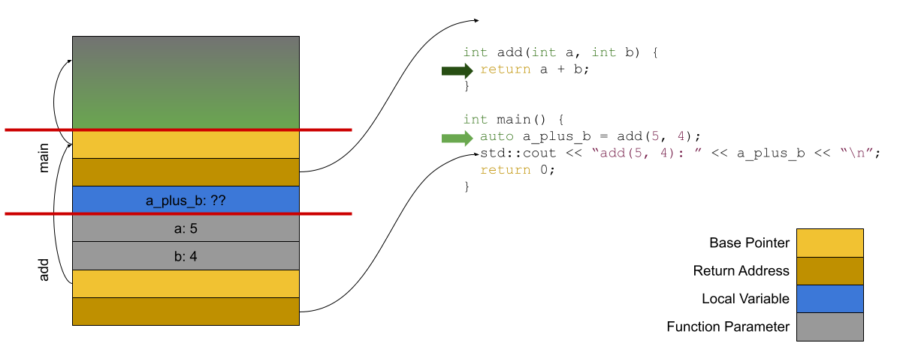
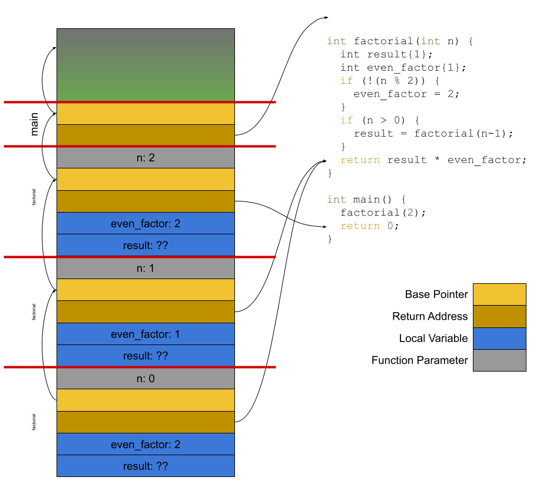
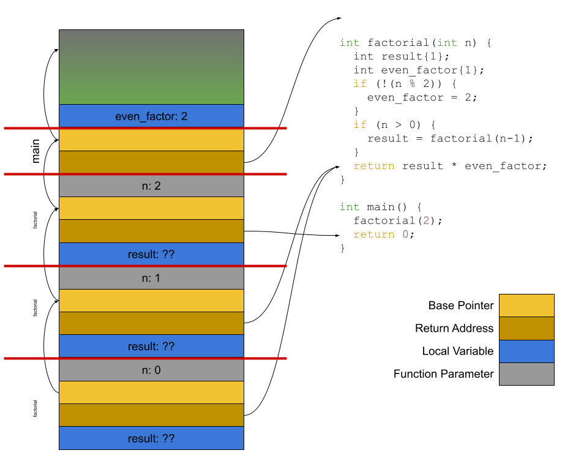

## What's News

The box office has come roaring back. After the success in theaters of Barbenheimer, Michael Mann's newest offering, [Bletchley Park](https://en.wikipedia.org/wiki/Bletchley_Park), broke records and earned an audience rating of A+ according to box-office tracker (dot)comScore.

## Functional Self Awareness

We all aspire to self awareness and subprograms are no different. Subprograms need to know certain information about themselves if they are to be able to operate correctly. In particular, they might need to know

1.  Where they can store the values the caller specified as arguments for their parameters (and, perhaps, whether the types of those values need to match the types of the parameters);
2.  How values are communicated between with their callers (i.e., how they get values for parameters from the code that called them and, when the subprograms are functions, how they send the values they generate back to the caller);
3.  Where they can store the values of their local variables;
4.  Where the program resumes execution after they are complete;

Though self aware, subprograms are not metaphysical -- they need someone else to start them. There is an entity that starts another subprogram -- the caller -- and there is a subprogram that is started -- the called (or callee); in other words, there are two sides.

The way that functions are started (and the coordination between them and the caller during the time that they are active) needs to be well specified or else, at best, one side does all the work while the other sits idle. At worst, when the sides are not coordinated, both sides work at cross purposes and the whole thing becomes a mess.

To be a little more concrete, think about the following program written in Python:

```Python
from typing import Optional

def didit(what: str) -> Optional[Oops]:
  result = action(what)
  if result == "again":
    return Oops("Result calculation failed.")
  return None

if __name__=="__main__":
  calculation = didit("ego")
  if calculation == None:
    print("Mission accomplished")
  else:
    print(f"There was an error doing the calculation: {calculation}")
```

The function `didit` takes a single parameter, `what`. When "main" calls `didit`, it needs to be sure that it agrees with `didit` about how it will "deliver" the value "ego". Without a mutual understanding on this point, `didit` cannot "receive" it and use it as the value of `what` ((2) from the list above). Then, `didit` will need to have some space to store the value it received ((1) from above). `didit` also needs some space to store `result` ((3) from above). Finally, `didit` (and the "main" function) need to be able to keep track of where they restart when they return from calls to other functions (`action`, and `didit`, respectively) ((4) from the list above).

## Push It Real Good

The data structure that holds all the information about an active function is known as the _stack frame_ (or the _activation record_). "Activation record" makes sense -- after all, the data structure contains a record of important information about _active_ functions. Why call it a stack frame?

The term comes from the way that all the instances of the activation records are ordered in memory. They form a stack! That stack is also known as the _runtime stack_ to differentiate it from the other instances of stack data structures that may exist in a program. What's more, they exist in _stack memory_ (I know, it's confusing) -- one of the two logical pieces of memory created by the computer's operating system.

Okay, now I get it! But, why a stack? Think about the characteristics of a subprogram and you will realize that it's a perfect fit for the use case: the last subprogram that was started is the first one that is exited. In other words, the activation records for executing and active functions are built and retired in a last-in-first-out order -- perfect for a stack! The stack frames exist in memory while the program is executing and, again, there is one stack frame for every active function and one for the executing function. And, for [historical reasons](https://tcm.computerhistory.org/ComputerTimeline/Chap37_intel_CS2.pdf)), the "stack grows down" -- the addresses of the newest stack frames are smaller than the addresses of the oldest stack frames.

Before talking about just how each individual stack frame is organized and what it holds, let's talk about what the runtime stack looks like at runtime and how it is maintained throughout program execution. To repeat, the structure that must be maintained is a last-in-first-out stack of these activation records -- one for each of the active functions and, at the very top (or bottom, depending on your perspective) will be the frame that is used to hold information about the executing function. Therefore, when a new function is invoked, a new frame will need to be added at the top (or, again, at the bottom). When a function terminates, it's frame will need to be removed.

At the time that those transitions happen (a function starts or a function ends), language designers establish a set of _invariants_. Those invariants are important to codify so that the calling function and the called function can communicate. An invariant is something that, well, never varies. Invariants are a really important concept in computer science. When there are invariants in our program, we can make assumptions that are more than mere assumptions. We can both assume that they are true and know that they are true. That gives us tremendous power as programmers, especially when those invariants make algorithms easier to write. The only downside to invariants is that we must _maintain_ the invariant. In other words, we need to guarantee that the properties of the invariant never, ahem, vary!

One of the questions for a language designer (as we mentioned above) is _who_ (the caller or the callee) is responsible for managing the creation and destruction of the frame. The code that performs the creation of the stack frame (and performs other bookkeeping and control-flow operations necessary to invoke the called function) is known as the _prologue_. Any code that needs to run to maintain the invariant at function invocation executes in the prologue. The code that performs the destruction of the stack frame (and performs the other operations necessary to transfer control back to the caller when a function terminates) is known as the _epilogue_. Any code that needs to run to maintain the invariant at function exit happens in the epilogue. As a result of the code in the prologue and the epilogue, the invariant is maintained at the times of transition between functions and, therefore, is true at all times that functions are executing! (Forgive me for repeating the _therefore_, but ...) Therefore, the tools that are generating (or interpreting) code for each programmer-defined function can rely on them -- we will see below how relying on invariants in the stack frame makes it easier to generate (or interpret) code from a user's functions.

Again, the process of calling/terminating a function and managing its stack frame must be coordinated between the caller and the callee. Theoretically, it's possible that the caller could do all the work. Or, the callee could do all the work. There's also the possibility that they could share the responsibility. Each language (and sometimes the platform -- the combination of hardware and operating system) are responsible for defining who performs what role. These standards are sometimes referred to as _calling conventions_ (See [here](https://www.uclibc.org/docs/psABI-x86_64.pdf) for an example of the description of the calling conventions that apply to Linux and macOS and [here](https://docs.microsoft.com/en-us/cpp/build/x64-calling-convention?view=msvc-170) for a description of the calling conventions that apply to Windows).

## Putting a Rabbit Into a Hat

(_Note_: What is described in this section is a general description of the contents of a stack frame. Each platform and language will create a different format for these data structures that is customized for the target hardware and the features of the language. For instance, Go has their own "internal" calling convections (online [here](https://go.googlesource.com/go/+/refs/heads/dev.regabi/src/cmd/compile/internal-abi.md)) for how two functions written in Go are able to coordinate the creation/destruction of a stack frame.)

To answer the function's metaphysical, soul-searching questions, each stack frame must _at least_ give the function a reference to

1.  space for its local variables
2.  space for its parameters
3.  information about where to resume program execution upon its termination

In most cases, the stack does better than just point to the space for local variables and parameters. Instead, the stack frame _is_ the space for the local variables and the parameters. Remember during the earlier discussion of variable lifetimes that one of the lifetimes was named _stack dynamic_? Well, now it makes sense -- the lifetime of local variables and parameters (Remember our definition of lifetime: the time when the variable is bound to storage) is only as long as the time that the function's activation record exists on the stack. We often think about a function that is executing as have access to both the local variables and the arguments, without really distinguishing between the two. So, do we really need to be that specific and keep them separate? Or can we treat them as almost the same thing?

Because the coordination of the creation and destruction of the stack frame is usually a cooperative endeavor between the caller and the callee, there is logical reason for a physical separation of the space in the stack frame for storing the arguments and the local variables. The _caller_ knows how many (and how big) the arguments are that it wants to pass to the callee when it is invoked. But, then again, so does the callee. What the caller knows that the callee does not is the value of those parameters. Therefore, the caller is in the best position to allocate the space necessary to hold the arguments that correspond to the parameters of the function being called. The caller's part of the prologue executes first (obviously) and, therefore, uses memory at a higher address. The callee itself knows how much storage it needs to perform its computation (i.e., store local variables) and is, therefore, optimally positioned for performing the portion of the prologue that allocates space for local variables. That part of the prologue is executed once program control has been transferred to the callee (obviously) so the space for those local variables will exist at lower addresses.

Unstated but important for the process of invoking a function is that the overhead of creation and destruction of a stack frame may play a significant role in decreasing a program's efficiency when functions are executed frequently. Is the overhead for calling two different functions always the same? Or, does it depend on some specific characteristics of the function being called? The latter! If a function named, say, `a`, has more parameters (or parameters that are bigger) and more local stack space, then the time it takes to copy values into those parameters and the time it takes to allocate space for local variables will be longer relative to a function named, say, `b` that has fewer parameters (or parameters that are smaller) and needs less local stack space. In other words, the time it takes to invoke a function is a function (pun intended) of the number (or size) of parameters and the size of the space required for storing local parameters.

In between the values for the function's parameters and the space for its local variables is where the callee stores the address of the program location to which to return upon its termination (the _return address_). It is between the storage for the arguments because it is the last value that the caller sets before handing off control to the called. Next to the return address (also between the parameters and locals) is the address of the stored _base pointer_. The base pointer is the bit of indirection that makes it possible for the compiler (or an interpreter) of a language to generate (or execute) the same code for a user-defined function _no matter when it is executed_ or even if it is the only active version of itself. 

Is there really a need for this base pointer? Why can't the compiler just embed addresses in the code that it generates for subprogram?

If we did not have the base pointer, the code that is generated (or executed) for a user-defined function would be specific to the location of its arguments/parameters and local variables in memory. That's a recipe for disaster -- there would need to be new, special code generated by the compiler every time that the function is executed -- unless we assume that the same memory is used for arguments and local variables _every_ time the subprogram is called. But, we all know that is not the case.

So, just how does the base pointer help the compiler or interpreter achieve this feat?

Assume that the function to be executed is `add` in

```C++
#include <iostream>

int add(int a, int b) { return a + b; }

int main() {
  auto a_plus_b = add(5, 4);
  std::cout << "add(5, 4) : " << a_plus_b << "\n";
  return 0;
}
```

To access a variable (either to read it or write it), its value must be read (or written) to (or from) memory. The code generated by the compiler for `add` (or the operation of the interpreter when executing `add`) can directly address `a` and `b` because they know their addresses. Right?

Right?

Wrong!

Why? Because it is impossible to know ahead of time just how many functions will be active at the same time as `add` and, depending on that number, the position in memory of the stack frame of `add` (and thus the position in memory of `a` and `b`) will vary from execution-to-execution.

Besides trolling StackOverflow, adding print statements and reading Reddit, computer scientists have a goto (pun _definitely_ intended) solution for nearly all problems: indirection. To determine the addresses for local variables, the compiler will generate code (or the interpreter will execute instructions) that access `a` and `b` as offsets relative to a known location. That known location is the _base pointer_. At any time during program execution, there is only one base pointer (it is _usually_ stored in a register in the hardware but does not have to be).

But, aren't there more than one active functions at a time? Why yes there are! So, what happens to the other base pointers? Great question. As part of the prologue and epilogue, the old value of the base pointer is (re)stored to/from the stack. It is _this_ value that is stored next to the return address between the parameters and the local variables.

The figure below shows the layout of the stack for the code above.



Inception
---------

Recursion is a very powerful problem-solving technique that allows the programmer to specify the solution to a challenge in terms of the solution itself. Having support for recursion in a programming language is a nice feature. Consider a program with a function that calculates the factorial (_Note_: This function named `factorial` computes something _like_ the factorial but not _actually_ the factorial -- cut me some slack!).

```C++
 1 int factorial(int n) {
 2   int result{1};
 3   int even_factor{1};
 4   if (!(n % 2)) {
 5     even_factor = 2;
 6   }
 7   if (n > 0) {
 8     result = factorial(n - 1);
 9   }
10   return result * even_factor;
11 }
12 
13 int main() {
14   factorial(2);
15   return 0;
16 }
```

The figure below shows the state of the runtime stack at the time when the recursion has "bottomed out" (i.e., when the recursion has reached the base case) and the results are about to percolate back up.



There is one very important thing to note about this diagram: Every active copy of the `factorial` function has _its own_ copies of local variables and parameters and they can each hold different values of those variables. At runtime, the code generated by the compiler (or the behavior of the interpreter) accesses the correct version of the variables by way of indirection through the base pointer. Remember that from above?

Also, note the position of the assignment to and read from `even_factor` (lines 5 and 10) -- they straddle the recursive call to the `factorial` function. The recursive call to `factorial` begins and ends between the time that the local variable `even_factor`'s value is set and the time that it is used.

Let's run the program and see what it computes:

| $n$ | Result |
| :----- | -----: |
| 2 | 4 |
| 3 | 4 |
| 4 | 8 |
| 5 | 8 |

Who's On First
--------------

Boy oh boy. Look at all the wasted space there, though. There are ... let me count ... how many copies of `even_factor` and `n` on the stack but there is only one that is really needed at a given time? Not to mention the fact that because there are so many different copies, the code generated by the compiler (or the execution of the interpreter) must use the base pointer to access the right one every time that value is read or written. So. Slow.

Let's make it easier and faster: There will only be a single copy of each function-local variable (and parameter). That means that the program will save space and will not have to use the base pointer to access values -- the location in memory of each of the local variables and the parameters can be known in advance because they will no longer vary with the depth of the stack. Pretty sweet!

Here's an equivalent snapshot of the stack frame after that optimization:



Where the program is paused, `factorial` is calculating on the basis of the parameter (`n`) with a value of `0`. `0 % 2` is `0`, `!0` is `true` and, therefore, the value of `even_factor` is `2`. Great.

Let's follow the execution to the next step. The version of `factorial` active with the parameter of `n` set to `0` (the one all the way at the bottom) completes and program control returns to the caller and begins at the line just after the recursive call (line 10). To calculate the value that the version of `factorial` with `n` equal to `1` will generate, the value of `even_factor` is multiplied by the result of the version of `factorial` that just completed.

See the problem yet? Slow it down. The version of the `factorial` function that is generating its value now is computing with the parameter `n` as `1`. That means that `even_factor` _should be_ `1`. And _it was_! At the time that the version of the `factorial` function computing with `n` equal to `1` invoked itself recursively, `even_factor` was `1`! However, because there is only one slot for a value of `even_factor` for the entire program as a result of our "optimization", its value changed between the time it was written and now when we are about to use it! Geez.

| $n$ | Result |
| :----- | -----: |
| 2 | 8 |
| 3 | 16 |
| 4 | 32 |
| 5 | 64 |


Nice optimization! It changed the behavior. After "Don't build Skynet", a fundamental axiom of computer science is that optimizations should not change the correctness of an algorithm!

## A Little of This and a Little of That

So, maybe that wasn't such a good idea after all. Without different copies of stack variables and parameters for each activation of a subprogram, a language cannot support recursion. Maybe that's not such a bad thing? After all, the programmer can always rewrite a recursive algorithm to perform the same calculations iteratively. And, the speedup of not having to perform indirect memory accesses might be worth the programmer's time. That's exactly the tradeoff that early language designers made when they developed languages like Fortran that did not support recursion.