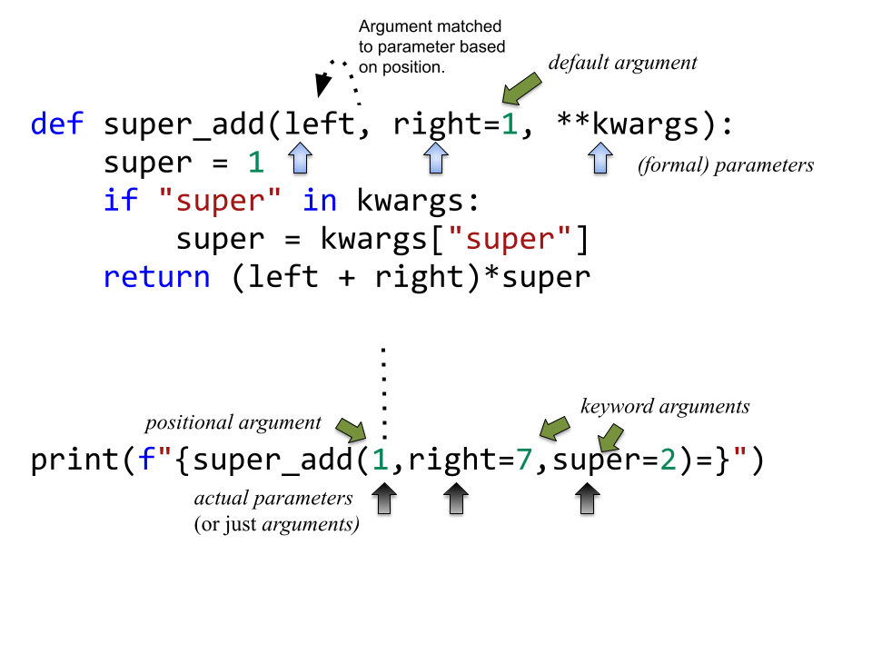

## What's News

A large private-equity investor has agreed to purchase the Subprogram fast-food chain from its founders, Developer Associates,for almost $10 billion. The new owner wants to add 23,000 restaurant's to the current 37,000 locations.

## Introduction
A _subprogram_ is a type of abstraction. It is _process abstraction_ where the _how_ of a process is hidden from the user who concerns themselves only with the _what_. A _subprogram_ provides process abstraction by naming a collection of statements that define parameterized computations.​ Again, the collection of statements determines how the process is implemented. _Subprogram_ _parameters_ give the user the ability to control the way that the process executes. There are three types of subprograms:

1.  Procedure: A subprogram that does _not_ return a value.
2.  Function: A subprogram that _does_ return a value.
3.  Method: A subprogram that operates with an implicit association to an object; a method may or may not return a value.

Pay close attention to the book's explanation and definitions of terms like _parameter,_ _parameter profile_, _argument,_ _protocol_, _definition_, and _declaration_.

Subprograms are characterized by three facts:

1.  A subprogram has only one entry point
2.  Only one subprogram is active at any time
3.  Program execution returns to the caller upon completion

## Calling a Subprogram: Matching Parameters with Arguments

There is a difference between (formal) parameters and actual parameters (also know as arguments). (Formal) parameters belong with the function definition (or the declaration, protocol). They give names to variables that the function implementation can use to refer to values that the user specifies at the time that the function is called. Those values (specified by the user) are called the arguments. The number, type and order of arguments must (sometimes) match the number, type and order of the parameters. In most cases, order is used to match the arguments to the parameters. The first parameter is matched to the first argument, and so on. Arguments that are matched with parameters in this way are known as _positional arguments_. Once the arguments are matched to the parameters, their types are confirmed to match. Matching arguments to parameters by their position implies that there are the same number of arguments and parameters.

So, why the caveat?

Languages offer different mechanisms to make matching parameters with arguments possible. Some languages offer _default arguments_, which allow the caller to leave off an argument by specifying a parameter's value in the absence of a user's choice. Some languages offer _keyword arguments_, which allow the caller to match a particular argument with a particular parameter out of order.

Python is a language that allows all those "features", and more!



The terminology used so far seems to imply that two-way communication between caller and called via arguments/parameters is not possible. There is an implication that communication from the called to the caller is only possible through a _return value_. This is most certainly not the case in every programming languages. Parameters can be:

1.  _in mode parameters_: The traditional type of parameter the caller communicates to the called (one way).
2.  _out mode parameters_: Where the called communicates with the caller (one way).
3.  _in/out mode parameters_: Where the caller and the called can communicate bidirectionally.

Those three definitions specify the semantics of communication between caller and called, but do not describe the mechanics. There are many ways that these modes of communication can be implemented and each have their own benefits and drawbacks:

1.  _Pass by value_: Used to implement in-mode parameters. A local variable (to the function implementation) with the name of the formal parameter is given _the value_ of the corresponding actual parameter. That value is usually obtained by copying -- hence the name.
2.  _Pass by result_: Used to implement out-mode parameters. A local variable with the name of the formal parameter is available to the function implementation. Upon termination of the function definition's execution, the value of that local variable is copied to give a new value to the corresponding actual parameter.
3.  _Pass by reference_: Used to implement in-out-mode parameters. A local variable with the name of the formal parameter contains an _access path_ (usually a pointer) to the argument. In the function implementation, all accesses/updates to the variable are done through the access path. Those accesses/updates are simultaneously visible to the called and the caller.

There are myriad ways that the choice of implementation methods for parameter passing can cause unexpected behavior. The most common issue that arises has to do with _aliasing_. When two (or more) names refer to the same variable, those names are said to be aliases. An access/update using the _different_ names changes the value of the _same_ variable. Obviously this can be surprising to the programmer who believes that an assignment statement giving a new value to the variable bound to two _different_ names is changing the value of two different variables. Aliasing is such a difficult problem to solve that some languages (C++) put the onus on the programmer to ensure that it never happens and make no guarantees about a program's behavior when aliasing is present.

## Polymorphism

_Polymorphism_ allows subprograms to take different types of parameters on different invocations. There are two types of polymorphism:

1.  _ad-hoc polymorphism:_ A type of polymorphism where the semantics of the function may change depending on the parameter types.
2.  _parametric polymorphism_: A type of polymorphism where subprograms take an implicit/explicit type parameter used to define the types of their subprogram's parameters; no matter the value of the type parameter, in parametric polymorphism the subprogram's semantics are always the same.​

Ad-hoc polymorphism is sometimes call function overloading (C++). Subprograms that participate in ad-hoc polymorphism share the same name but must have different protocols. If the subprograms' protocols and names were the same, how would the compiler/interpreter choose which one to invoke? Although a subprogram's protocol includes its return type, not all languages allow ad-hoc polymorphism to depend on the return type (e.g., C++). See the various definitions of `add` in the C++ code here: [https://github.com/hawkinsw/cs3003/blob/main/subprograms/subprograms.cpp](https://github.com/hawkinsw/cs3003/blob/main/subprograms/subprograms.cpp). Note how they all have different protocols. Further, note that not all the versions of the function `add` perform an actual addition! That's the point of _ad-hoc polymorphism_ -- the programmer can change the meaning of a function.

Functions that are parametrically polymorphic are sometimes called function templates (C++) or generics (Java, Go, Rust). A parametrically polymorphic function is like the blueprint for a house with a variable number of floors. A home buyer may want a home with three stories -- the architect takes their variably floored house blueprint and "stamps out" a version with three floors. Languages variously call the process _instantiating_ a parametrically polymorphic function. Others call it [monomorphization](https://en.wikipedia.org/wiki/Monomorphization).

The type parameter of a parametrically polymorphic function can be either inferred from the types of the arguments to a particular invocation (or call) of the function or specified explicitly.

Here's an example from C++:

```C++
template <typename T> T minimum(T a, T b) {
  if (a <= b) {
      return a;
  } else {
      return b;
  }
}

```
Note that there is only _one_ definition of the function! In C++, the type parameter referred to in the definition of _parametric polymorphism_ is explicit -- in this case `T`. When a programmer uses a parametrically polymorphic function by calling it, a value for `T` is deduced from the types of the arguments in the call. Every time the compiler sees a user make a call with a different version of `T`, the compiler will "stamp out" a new copy of `minimum` with different types that replace `T`.

When the programmer writes,

```C++
    auto m = minimum(5, 4);
```

the compiler will generate

```C++
int minimum(int a, int b) {
  if (a <= b) {
    return a;
  } else {
    return b;
  }
}
```

behind the scenes.

You can verify that this is, indeed, the case by using an awesome tool known as [C++ Insights](https://cppinsights.io/). The particular example just explored can be seen [here](https://cppinsights.io/s/1b8aa1e2).

In Go, the newest language to offer such parametric polymorphism, the same example would look like:

```Go
import (
    "fmt"
    "golang.org/x/exp/constraints"
)

func minimum[T constraints.Ordered](a T, b T) T {
    if a < b {
        return a
    } else {
        return b
    }
}
```

There is a very interesting difference between the Go version of `minimum` and the C++ version. In addition to requiring that the developer specify that the function `minimum` takes a parametric type (named `T` in this case), Go requires an additional bit of information (in this case `constraints.Ordered`). The additional bit of information is (not surprisingly) known as a _constraint_. Constraints on type parameters are like types on variables -- they limit the range of valid values for the type parameter. In this case, the `constraints.Orderable` constraint specified by the programmer for `minimum` tells the user of the parametrically polymorphic `minimum` function that the only valid types that can be accepted by an instance of the `minimum` function are those that can be _ordered_. The constraint specifies the operations that a type must support to be usable in the context. For instance, for `minimum`, it would make no sense to call the function with two arguments whose values cannot be ordered relative to one another (how could you calculate the minimum, then?). C++ has added similar functionality (known as concepts) and Rust has traits.

## Coroutines

Just when you thought that you were getting the hang of subprograms, a new kid steps on the block: coroutines. Sebesta defines _coroutines_ as a subprogram that cooperates with a caller. The first time that a programmer uses a coroutine, they _call_ it at which point program execution is transferred to the statements of the coroutine. The coroutine executes until it _yields_ control. The coroutine may yield control back to its caller or to another coroutine. When the coroutine yields control, it does not cease to exist -- it simply goes dormant. When the coroutine is again invoked -- _resumed_ -- the coroutine begins executing where it previously yielded. In other words, coroutines have

1.  multiple entry points
2.  full control over execution until they yield
3.  the property that only one is active at a time (although many may be dormant)

Coroutines could be used to write a card game. Each player is a coroutine that knows about the player to their left (that is, another coroutine). The PlayerA coroutine performs their actions (perhaps drawing a card from the deck, etc) and checks to see if they won. If they did not win, then the PlayerA coroutine yields to the PlayerB coroutine who performs the same set of actions. This process continues until a player no longer has someone to their left. At that point, everything unwinds back to the point where PlayerA was last resumed -- the signal that a round is complete. The process continues by resuming PlayerA to start another round of the game. Because each player is a coroutine, it never ceases to exist and, therefore, retains information about previous draws from the deck. When a player finally wins, the process completes. To see this in code, check out [https://github.com/hawkinsw/cs3003/blob/main/subprograms/cardgame.py](https://github.com/hawkinsw/cs3003/blob/main/subprograms/cardgame.py).

Can you see anything similar between objects in an object-oriented programming language and coroutines? Both can store information (state) private to themselves and separate from others (as local variables and member variables, respectively) as long as they are in existence. Both can be assigned to variables and moved -- maybe they really aren't all that different at all!