## What's News

The international community's fascination with [unidentified aerial phenomenon](https://www.wsj.com/science/nasa-panel-report-ufos-unidentified-anomalous-phenomena-83cdd26f?st=te4ji4axww7i1iv&reflink=desktopwebshare_permalink) has reached new heights. The Internet group semantic expression translation initiative ([SETI](https://setiathome.berkeley.edu/)) has formed to decide whether extraterrestrials may be sending humans syntactically valid and typesafe JavaScript code in an attempt to prove their intelligence.

## Making Meaning

Although syntax is something that generally concerns the _validity_ of the program and not its correctness (i.e., its semantics), a language may have _static semantics_ that the compiler can check during syntax analysis.

Again, syntax and syntax analysis is only concerned with whether a program is valid or not. If the program, considered as a string of letters of the language's alphabet, can be derived from the language grammar's start symbol, then the program is valid. We all agreed that was the limit of what a syntax analyzer could determine.

We have converted the raw text of a program to a parse tree by hand. However, that is usually done by the parser, a piece of software that generates a parse tree. It is possible to apply "decoration" to the parse tree in order to verify certain extra-syntactic properties of a program at the time that it is being parsed. The properties of a program that can be checked using such a decorated tree are known as a language's _static semantics_. 

More formally, Sebesta defines static semantics as the rules for a valid program in a particular language that are difficult (or impossible!) to encode in a grammar. Checking static semantics early in the compilation process is incredibly helpful for programmers as they write their code and allows the stages of the compilation process after syntax analysis to make more sophisticated assumptions about a program's validity.

One example[^example] of static semantics of a programming language has to do with its type system. Checking a program for type safety is possible at the time of syntax analysis using an _attribute grammar_. An attribute grammar is an extension of a CFG that adds (static semantic) information to its terminals and nonterminals.​ This information is known as _attributes_. In an attribute grammar,  productions are augmented with attribute calculation functions. During parsing, the attribute calculation function(s) associated with a production are evaluated every time that the production is used in a derivation. The results of the invocation are stored in the nodes of the parse tree created by the production in the derivation. Additionally, in an attribute grammar, each production can have a set of _predicates_. Predicates are simply Boolean-valued functions. When a parser attempts to use a production during parsing, it's not just the attribute calculation functions that are invoked -- the production's predicates are, too. If any of the invocations of those predicates returns false during a derivation, then the derivation fails.

[^example]: Remember, what we are discussing here is just _one_ example. There are many different properties of a program that you can check using static semantics.

## An Assignment Grammar

Grammars are not just an academic tool. They can be found in the real world. In particular, the C language standard includes a grammar for the language. The snippet(s) related to the assignment expression are shown below:

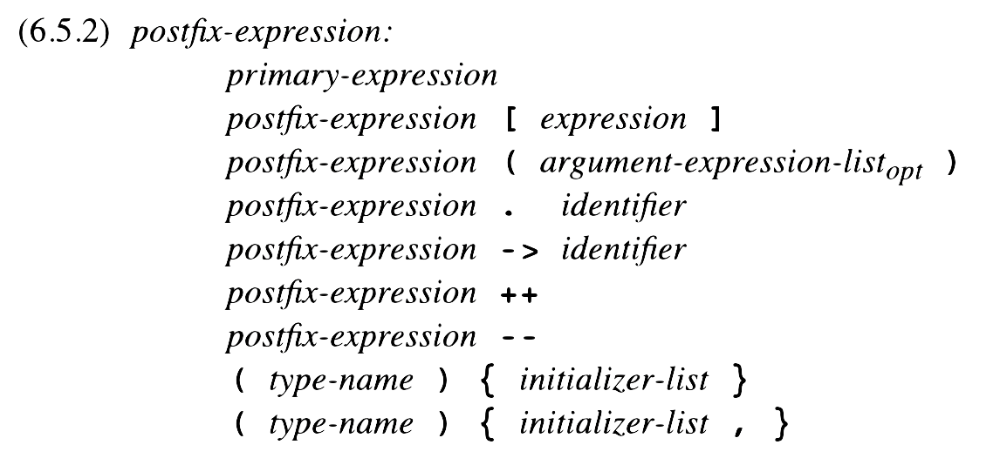
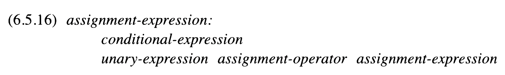
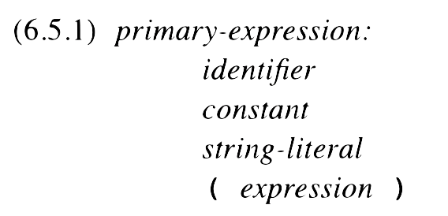
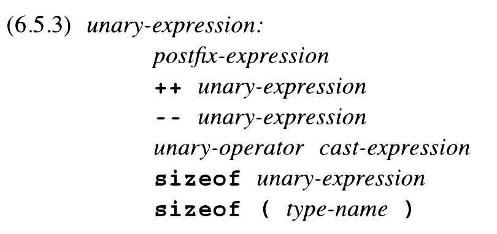

There are lots of details in the grammar for an assignment statement in C and not all of them pertain to our discussion. So, instead of using that grammar of assignment statements, we'll use a simpler one:

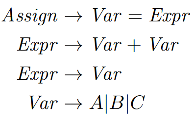

Assume that these productions are part of a larger grammar for a complete, statically typed programming language. In the subset of the grammar that we are going to work with, there are three terminals: `A`, `B` and `C`. These are variable names available for the programmer in our language. As a program in this language is parsed, the compiler builds a mapping between variables and their types and keeps them in something known as the _symbol table_[^symbol]. An entry is added to the symbol table for each new variable declaration the parser encounters. The compiler can "lookup" the type of a variable using its name thanks to the symbol table's _lookup_ function.

[^symbol]: A symbol table is a concept used regularly in the implementation of compilers. If you are interested in compilers, be sure to take the course on compilers (EECE 5138).

Our hypothetical language contains only two numerical types: `int` and `real`. A variable can only be assigned the result of an expression if that expression has the same type as the variable. In order to determine the type of an expression, our language adheres to the following rules:

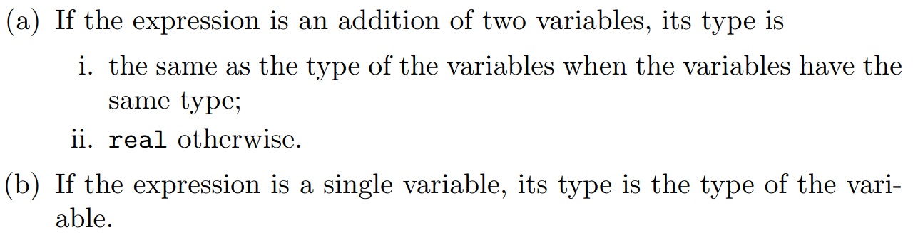

Let's assume that we are looking at the following program written in our hypothetical language:

```
int A;
real B;
A = A + B;
```

The declarations of the variables `A` and `B` are handled by parts of the grammar that we are not showing in our example. Again, when those declarations are parsed, an entry is made in the symbol table so that variable names can be mapped to types. Let's derive `A = A + B;` using the snippet of the grammar shown above:

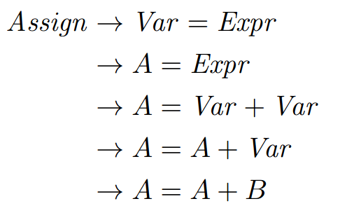

Great! The program passes the syntactic analysis so it's valid!


Right?

## This Grammar Goes To 11

Wrong. According to the language's type rules, we can only assign to variables that have the same type as the expression being assigned. The rules say that `A + B` is a `real` (a.ii). `A` is declared as an `int`. So, even though the program parses, it is invalid!

We can detect this error using attribute grammars and that's exactly what we are going to do! For our Assign grammar, we will add the following attributes to each of the terminals and nonterminals:

*   `expected_type`: The type that is expected for the expression.
*   `actual_type`: The actual type of the expression.

Again, the values for the attributes are set according to _attribute calculation functions_. An attribute whose calculation function uses attribute values from only its children in the parse tree as input is known as a _synthesized attribute_. An attribute whose calculation function uses attribute values from its parent and peer nodes in the parse tree is known as an _inherited attribute_.

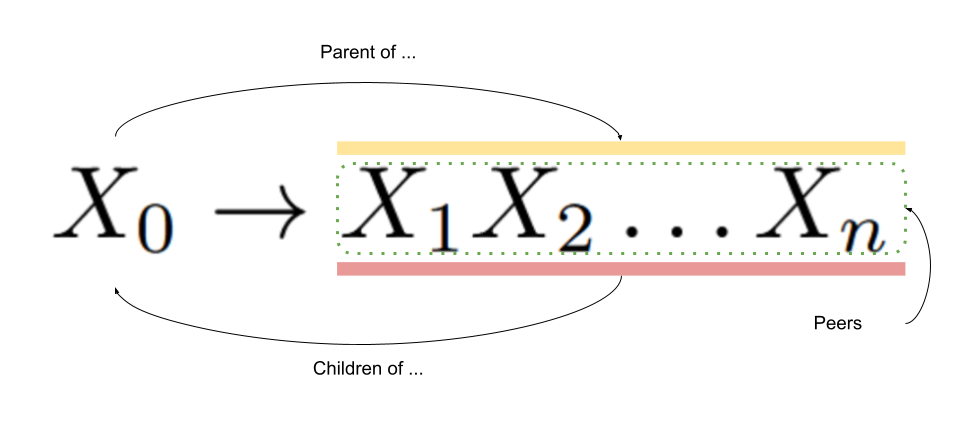

Let's define the attribute calculation functions for the `expected_type` and `actual_type` attributes of the Assign grammar:

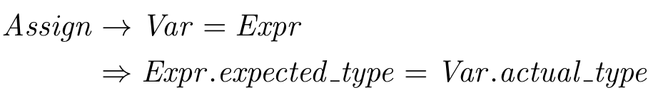

For this production, we can see that the expression's `expected_type` attribute is defined according to the variable's `actual_type` which means that, from the perspective of the expression, it is an inherited attribute. I have always thought that this organization was a little strange. But then I really started to think about it, and it made sense. 

We said that the attribute calculation functions are invoked when the production with which they are associated are used in the derivation. When we are using this production, all that is known for sure about the right hand side of the `=` is that there is an expression (assuming that the program is syntactically valid). We don't know, however, anything about the _form_ of that expression. We don't know whether it is a `+` or a simple variable access. On the other hand, we know that the lefthand side of the `=` is a variable and that we can always query the symbol table to find out the variable's type (see intrinsic attributes, below).

So, ... the attribute on this production "pushes" the actual type of the variable "down" to the expression as the expression's expected type. Neat! But, just how does that help us type check the program? Patience. We'll get there.


For this production, we can see that the expression's `actual_type` attribute is defined according to the variable's `actual_type` which means that, again from the expression's perspective, it is a synthesized attribute.

And now for the most complicated (but not complex) attribute calculation function definition:

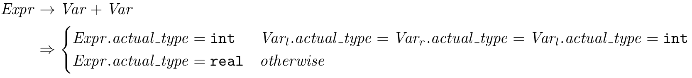

We can see that the expression's `actual_type` attribute is defined according to its children nodes -- the `actual_type` of the two variables being added together -- which means that it is a synthesized attribute. 

If you are thinking that the attribute calculation functions are recursive, you are exactly right! And, you can probably see a problem straight ahead. So far the attribute calculation functions have relied on attributes of peer, children and parent nodes in the parse tree to already have values. Where is our base case?

Great question. There's a third type of attribute known as an _intrinsic attribute_. An intrinsic attribute is one whose value is calculated according to some information outside the parse tree. In our case, the `actual_type` attribute of a variable is calculated according to the mapping stored in the symbol table and accessible by the _lookup_ function that we defined above.

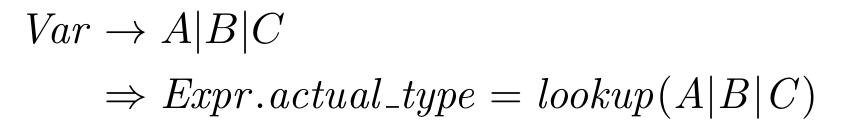

That's all for the definition of the attribute calculation functions and is all well and good. Unfortunately, we still have not used our attributes to inform the parser when a derivation has gone off the rails by violating the type rules. We'll define these guardrail predicate functions and show the complete attribute grammar at the same time:

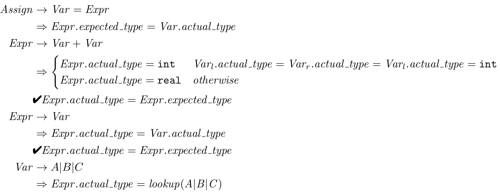

The equalities after the checkmarks are the predicates. We can read them as "If the actual type of the expression is the same as the expected type of the predicate, then the derivation (parse) can continue. Otherwise, it must fail because the assignment statement being parsed violates the type rules."

### Put The Icing On The Cookie

The process of calculating the attributes of a production during parsing is known as _decorating_ the parse tree. Let's look at the parse tree from the assignment statement `A = A + B;` and see how it is decorated:

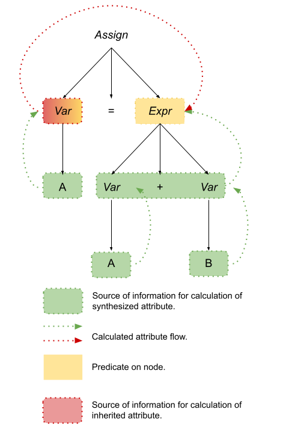