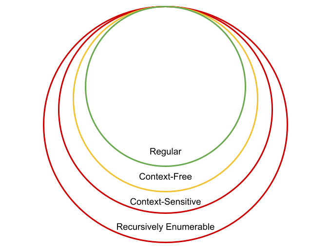
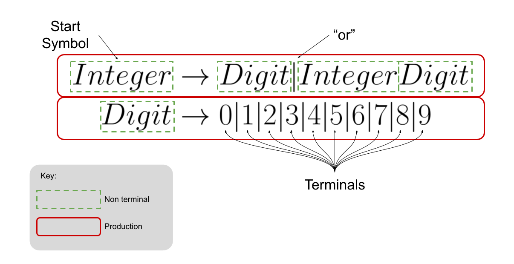
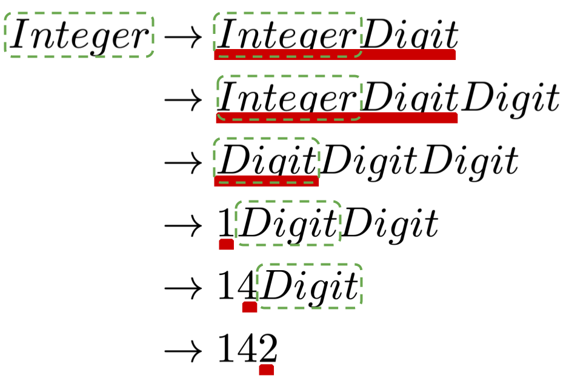

## What's News
The Nobel Committee today announced this year's winners for the [Nobel Prize for Literals](https://www.nobelprize.org/prizes/lists/all-nobel-prizes-in-literature/). They gave the award to a set of anthropologists who have successfully uncovered the origins of languages. Their seminal contribution was a realization that, yes, all languages do require the proper use of a semicolon.

## Back to Basics
So far we have covered lots of material. We've learned lots of definitions, explored lots of concepts and programmed in languages that we've never seen before. In all that time, though, we never really got to the bottom of one thing: _What exactly is a language?_

Let's think _way_ back and recall two very important definitions: syntax and semantics. We defined _semantics_ as the effect of each statement's execution on the program's operation and we defined _syntax_ as the rules for constructing structurally valid (note: valid, not correct) computer programs in a particular language. There's that word again -- _language_.

Before starting to define _language_, let me offer you two alternate definitions for syntax and semantics that draw out the distinction between the two:

*   The syntax of a programming language specifies the _form_ of its expressions, statements and program units.
*   The semantics of a programming language specifies the _meaning_ of its expressions, statements and program units.

It is interesting to see those two definitions side-by-side and realize that they are basically identical with the exception of a single word! One final note about the connection between syntax and semantics before moving forward: Remember how a well-designed programming language has a syntax that is evocative of meaning? In other words, a [well-designed language](https://stackoverflow.com/questions/1345843/what-does-the-question-mark-at-the-end-of-a-method-name-mean-in-ruby) might allow variables to contain a symbol like `?` which would allow the programmer to indicate that it holds a Boolean.

Before we can specify a syntax for a programming language, we need to specify the language itself. In order to do that, we need to start by defining the language's _alphabet_ -- the finite set of characters that can be used to write sentences in that language. We usually denote the alphabet of a language with the $\Sigma$. It is sometimes helpful to denote the set of all the possible sentences that can be written using the characters in the alphabet. We usually denote that with $\Sigma^{\cdot}$. For example, say that $\Sigma=\{a, b\}$, then $\Sigma^{\cdot}=\{a, b, aa, ab, ba, aaa, aab, aba, abb, \ldots \}$. Notice that even though $|\Sigma|$ is finite (that is, the number of elements in $\Sigma$ is finite), $|\Sigma^{\cdot}|=\infty$.

The alphabet of the C++ programming language is large, but it's not infinite. However, the set of sentences that can be written using that alphabet is infinite. But, as we all learn early in our programming career, just because you can write out a program using the valid symbols in the C++ alphabet does not mean the program is syntactically valid. The very job of the compiler is to distinguish between valid and invalid programs, right?

Let's call the language that we are defining $L$ and say that it's alphabet is $\Sigma$. $L$ can be thought of as the set of all valid sentences in the language. Therefore, every sentence that is in $L$ is in $\Sigma^{\cdot}$ -- $L \subseteq \Sigma$.


Look closely at the relationship between $\Sigma^{\cdot}$ and $L$. While $L$ never includes a sentence that is not included in $\Sigma^{\cdot}$, they can be identical! Think of some languages where any combination of characters from its alphabet are valid sentences! Can you come up with one?

## The Really Bad Programmer

So, how can we determine whether a sentence made up of characters from the alphabet is in the language or not? We have to be able to answer this question -- one of the fundamental jobs of the compiler, after all, is to do exactly that. Why not just write down every single valid sentence in a giant chart and compare the program with that list? If the program is in the list, then it's a valid program! That's easy.

Not so fast. Aren't there an infinite number of valid C++ programs?

```C++
int main() {
  if (true) {
    if (true) {
      if (true) {
        ...
          std::cout << "Hello, World.";
      }   
    } 
  } 
} 
```

Well, dang. There goes that idea.

It would be great to have a tool for languages that allows us to create something that _recognizes_ and _generates_ valid sentences in the language. We will do exactly that!

## Language Classes

The famous linguist Noam Chomsky was the first to recognize how there is a hierarchy of languages. The hierarchy is founded upon the concept of how easy/hard it is to write a concise definition for the language's valid sentences.



Each level of Chomsky's Hierarchy, as it is called, contains the levels that come before it. Which languages belong to which level of the hierarchy is something that you will cover more in CS4040. (Note: The languages that belong to the _Regular_ level can be specified by [regular expressions](https://en.wikipedia.org/wiki/Regular_expression). Something I know some of you have written before!)

For our purposes, we are going to be concerned with those languages that belong to the Context-Free level of the hierarchy.

## Context-Free Grammars

The tool that we can use to concisely specify a Context-Free language is called a _Context-Free Grammar_. Precisely, a Context-Free Grammar, $G$, is a set of productions $P$, a set of terminal symbols, $T$, and a set of non-terminal symbols, $N$, one of which is named $S$ and is known as the start symbol.

That's a ton to take in. The fact of the matter, however, is that the vocabulary is intuitive once you see and use a grammar. So, let's do that. We will define a grammar for listing/recognizing all the positive integers:



Now that we see an example of a grammar and its parts and pieces, let's "read" it to help us understand what it means. Every valid integer in the language can be _derived_ by writing down the start symbol and iteratively replacing every non-terminal according to a production until there are only terminals remaining! Again, that sounds complicated, but it's really not. Let's look at the derivation for the integer 142:



We start with the start symbol $Integer$ and use the first production to replace it with one of the two options in the production. We choose to use the second part of the production and replace $Integer$ with $Integer Digit$. Next, we use a production to replace $Integer$ with $Integer Digit$ again. At this point we have $Integer Digit Digit$. Next, we use one of the productions to replace $Integer$ with $Digit$ and we are left with $Digit Digit Digit$. Our next move is to replace the left-most $Digit$ non-terminal with a terminal -- the `1`. We are left with `1` $Digit Digit$. Pressing forward, we replace the left-most $Digit$ with `4` and we come to `14`$Digit$. Almost there. Let's replace $Digit$ with `2` and we get `142`. Because `142` contains only terminals, we have completed the derivation. Because we can $derive$ `142` from the grammar, we can confidently say that `142` is in the language described by the grammar. You can say that you proved a sentence is in a language, _by construction_, if you can construct a derivation for that sentence using the productions of the grammar.