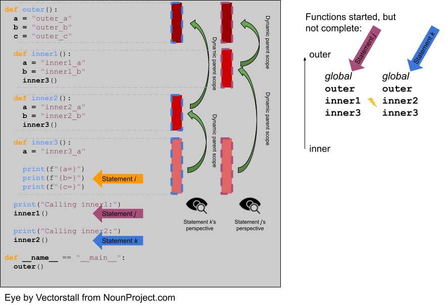

### What's News

Increasingly desperate programmers are searching high and low for deals on variable names in light of rising inflation. Economists and sociologists say the ones that are succeeding are relying on their knowledge of scope resolution to sniff out value. But first, the Census Bureau released their latest actuarial numbers saying that the expected lifetime of a variable edged up this year from Implicit Heap Dynamic to Stack Dynamic.

### Variables' Storage Bindings

The storage binding is related to the variable's _lifetime_, the time during which a variable is bound to memory. There are four common lifetimes:

1. **static**: Variable is bound to storage before execution and remains bound to the same storage throughout program execution.
    1. Variables with static storage binding cannot share memory with other variables (they need their storage throughout execution).
    2. Variables with static storage binding can be accessed directly (in other words, their access does not require redirection through a pointer) because the address of their storage is constant throughout execution. Direct addressing means that accesses are faster.
    3. Storage for variables with static binding does not need to be repeatedly allocated and deallocated throughout execution -- this will make program execution faster.
    4. In C++, variables with static storage binding are declared using the `static` keyword inside functions and classes.
    5. Variables with static storage binding are sometimes referred to as _history sensitive_ because they retain their value throughout execution.
2.  **stack dynamic**: Variable is bound to storage when it's declaration statements are _elaborated_, the time when a declaration statement is executed.
    1. Variables with stack dynamic storage bindings make recursion possible because their storage is allocated anew every time that their declaration is elaborated. To fully understand this point it is necessary to understand the way that function invocation is handled using a runtime stack. We will cover this topic next week. Stay tuned!
    2. Variables with stack dynamic storage bindings cannot be directly accessed. Accesses must be made through an intermediary which makes them slower. Again, this will make more sense when we discuss the typical mechanism for function invocation.
    3. The storage for variables with stack dynamic storage bindings are constantly allocated and deallocated which adds to runtime overhead.
    4. Variables with stack dynamic storage bindings are _not_ history sensitive.
3.  **Explicit heap dynamic**: Variable is bound to storage by explicit instruction from the programmer. E.g., `new`/`malloc` in C/C++.
    1. The binding to storage is done at runtime when these explicit instructions are executed.
    2. The storage sizes can be customized for the use.
    3. The storage is hard to manage and requires careful attention from the programmer.
    4. The storage for variables with explicit heap dynamic storage bindings are constantly allocated and deallocated which adds to runtime overhead.
4. **Implicit heap dynamic**: Variable is bound to storage when it is assigned a value at runtime.
    1. All storage bindings for variables in Python are handled in this way: "It is important to understand that the management of the Python heap is performed by the interpreter itself and that the user has no control over it, even if they regularly manipulate object pointers to memory blocks inside that heap. The allocation of heap space for Python objects and other internal buffers is performed on demand by the Python memory manager through the Python/C API functions listed in this document." [Cite](https://docs.python.org/3/c-api/memory.html) 
    2. When a variable with implicit heap dynamic storage bindings is assigned a value, storage for that variable is dynamically allocated.
    3. Allocation and deallocation of storage for variables with implicit heap dynamic storage bindings is handled automatically by the language compiler/interpreter. (More on this when we discuss memory management techniques in Module 3).

### A Brain Teaser:

Here's something that I hope will make you think ... What does the following program print? Working through the expectation of the output will help you check whether you understand what we've discussed so far.

```C++
#include <iostream>
 
bool *function1() {
  bool return_value = true;
  return &return_value;
}
 
int function2() {
  int return_value = 0;
  return return_value;
}
 
int main() {
  bool *function1_result = function1();
  int function2_result = function2();

  if (*function1_result) {
    std::cout << "True!n";
  } else {
    std::cout << "False!n";
  }
  return 0;
}
```

<details><summary>Answer</summary>

The program contains undefined behavior (!!). `function1` returns a pointer to a variable whose lifetime is stack dynamic. As a result, the lifetime of that variable ends when the function completes execution. Therefore, the storage associated with that variable is given back to the system for reuse by another variable. 

However, back in `main`, we dereference that pointer, assuming that the target of the pointer is to memory that we still own. Because that is not the case, the pointer is considered invalid and

> Indirection through an invalid pointer value and passing an invalid pointer value to a deallocation function have undefined behavior.

Sad trombone.

</details>

### Scope
_Scope_ is the range of statements in which a certain name can be used to access (either through reference or assignment) a variable. Using the vocabulary of bindings, _scope_ can also be defined as the collection of statements which can access a name binding. In other words, scope plays a role in determining the binding of a name to a variable.

It is easy to get fooled into thinking that a variable's name attribute is somehow intrinsic to the variable. However, a variable's name is just another attribute bound to a variable (like address, storage, value, etc) that may change throughout program execution. So, then, how is the binding between name and variable done? When is it done?

Before we get started answering those questions, it helps to think about two different types of scopes, _local_ and _non-local_.

* local: A variable is locally scoped to a unit or block of a program if it is declared there. Though not entirely synonymous, because the phrase "unit or block of a program" is so cumbersome we will play a little fast and loose with the definition of scope and use the terms interchangeably. To be clear, however, when we are using the phrase scope in the context of a variable being local, we are talking about the parts of a program (in whatever language you are working in) where name-to-variable bindings must be unique. In Python, such a region is defined by function and class definitions. In Python, a variable that is the subject of an assignment is local to the block of code defining that function. For instance, in

```Python
def add(a, b):
  total = a + b
  return total
```

`total` is a local variable. In C++, a variable is local to the part of the source code beginning at the variable's declaration and continuing through the the `}` that matches the most recent `{`. Yes, I know that's way more complicated than it needs to be, but it's accurate. It is easier to simplify slightly and say that a variable is local to the part of the source code between the most closely nested `{` and its matching `}`. For instance, in

```C++
#include <iostream>
 
int main() {
  int a{0};

  if (a == 0) {
    int b{0};
  }
}
```

`b` is local to the source code between the `{` in the if statement. `a` is local to the scope between the `{`  and `}` that delimit the body of the `main` function.

* non-local: A variable is non-local if it can be accessed (again, through reference or assignment) but is not local.

Now, let's return to the issue of determining how the language determines the variable to which a name refers. In other words, let's talk about the ways a language can determine the binding between a name and a variable.

First, by definition, if the programmer references the name of a local variable, the binding can be determined relatively easily. However, it gets interesting if the programmer refers to the name of a non-local variable.

Here is _the_ most common algorithm for performing the resolution of the binding between a variable and a name. The process described by this algorithm is known as _scope resolution_. The algorithm is described with respect to a statement, $s$. Think of $s$ as the statement that uses the name to be resolved (which we will refer to as $x$):

1. If $x$ names a local variable, $x$ is bound to that variable.
2. If $x$ does not name a local variable, consider the parent scope of $s$, $p$.
3. If the parent scope $p$ contains a local variable named $x$, $x$ is bound to that variable.
4. If the name $x$ is still not bound to a variable, consider the parent scope of $p$, $p'$. Continue searching parent scopes until there are no more ancestor scopes.

The algorithm is relatively straightforward, right? All that formalism reflects our intuition that we resolve name to variable bindings by looking for the declaration of the name beginning as close to the point of its use as possible and then continuing to work outward.

Well, yes, but we haven't yet discussed the most important part(s) of that algorithm, have we? What, exactly, is _parent scope_ and what are _ancestor scopes_?

#### Static Scoping

_Static scoping_, also known as _lexical scoping_ is a scope resolution policy where the binding of a name to a variable can be determined using only the program's source code. The parent scope (using our slightly loose definition of scope here [see above]) of a statement $s$ is the unit/block of a program that declared the unit/block of the program that contains $s$.

Statically scoped languages are the kind of languages that we are used to! The way that they perform scope resolution is so natural it almost seems uninteresting to discuss the algorithm!

However, here is an example to consider just to make sure that we are on the same page.

```Python
def outer():
  a = "outer contents of a"
  b = "outer contents of b"
  c = "outer contents of c"
  def inner():
    a = "inner contents of a"
    b = "inner contents of b"
    def inner_inner():
      a = "inner inner contents of a"
      print(f"{a=}")
      print(f"{b=}")
      print(f"{c=}")
    inner_inner()
  inner()  
if __name__=="main":  
  outer() 
```


When _Statement i_ is encountered statically, the algorithm for resolving the binding between name $a$ and a variable proceeds as follows:

1. $a$ is a local variable. The name is bound to the local variable.

Pretty easy, right?

Now, what happens when the statement after _Statement i_ is encountered statically and the binding between $b$ and a variable needs to be resolved?

1. $b$ is not a local variable.
2. Resolution proceeds to search the static parent of _Scope a_ for a local variable named $b$.
3. _Scope b_ does contain a local variable named $b$. The name is bound to that local variable.

Just what we expected!

And, finally, what happens when the binding between the name $c$ and a variable needs to be resolved?

1. $c$ is not a local variable.
2. Resolution proceeds to search the static parent of _Scope a_ for a local variable named $c$.
3. _Scope b_ does not contain a local variable named $c$.
4. Resolution proceeds to search the static parent of _Scope b_ for a local variable named $c$.
5. _Scope c_ does contain a local variable named $c$. The name is bound to that local variable.

Lots of work, but largely as expected! Given that, the program prints what we would expect:

```Python
a='inner inner contents of a'
b='inner contents of b'
c='outer contents of c'
```

**Consider this ...**
Python and C++ have different ways of creating scopes. In Python and C++, a new scope is created at the beginning of a function definition (and that scope contains the function's parameters automatically). However, Python and C++ differ in the way that scopes are declared (or not!) for variables used in loops. Consider the following Python and C++ code (also available at [https://github.com/hawkinsw/cs3003/blob/main/scope_lifetime/loop_scope.cpp](https://github.com/hawkinsw/cs3003/blob/main/scope_lifetime/loop_scope.cpp) and [https://github.com/hawkinsw/cs3003/blob/main/scope_lifetime/loop_scope.py](https://github.com/hawkinsw/cs3003/blob/main/scope_lifetime/loop_scope.py)):

```Python
def f():
  for i in range(1, 10):
    print(f"i (in loop body): {i}")
  print(f"i (outside loop body): {i}")  
```

```C++
void f() {
  for (int i = 0; i<10; i++) {
    std::cout << "i: " << i << "\n";
  }  
// The following statement will cause a compilation error  
// because i is local to the code in the body of the for   
// loop.   
// std::cout << "i: " << i << "\n";  
} 
```

In the C++ code, the `for` loop introduces a new scope and `i` is in that scope. In the Python code, the `for` loop does not introduce a new scope and `i` is in the scope of `f`. Try to run the following Python code (also available at [https://github.com/hawkinsw/cs3003/blob/main/scope_lifetime/loop_scope_error.py](https://github.com/hawkinsw/cs3003/blob/main/scope_lifetime/loop_scope_error.py)) to see why this distinction is important:

```Python
def f():
  print(f"i (outside loop body): {i}")
  for i in range(1, 10):
    print(f"i (in loop body): {i}")
```

#### Dynamic Scoping
Static scoping is what we have grown up with, so to speak, as programmers. We are so used to it that it almost seems like the _only_ way to do scope resolution! And yet, there is another way!

_Dynamic scoping_ is the type of scope that can be determined only during program execution. In a dynamically scoped programming language, determining the name/value binding is done iteratively by searching through a block's nested _dynamic parents_. The _dynamic parent_ of a block is the block from which the current block was _executed_. Very few programming languages use dynamic scoping (BASH, Perl [optionally]) because it makes checking the types of variables difficult for the programmer (and impossible for the compiler/interpreter) and because it increases the "distance" between name/variable binding and use during program execution. However, dynamic binding makes it possible for functions to require fewer parameters because dynamically scoped non-local variables can be used in their place. We will learn more about this latter advantage when we discuss closures during our exploration of functional programming languages.

The concept of _dynamic parents_ has a close connection with _activation records_ (a.k.a. _stack frames_) and the _runtime stack_ which we will study in a few lessons. In the meantime, let's assume that Python is a dynamically scoped language and decipher the output of the same program as above:

```console
Calling inner1:
a='inner3_a'
b='inner1_b'
c='outer_c'
Calling inner2:
a='inner3_a'
b='inner2_b'
c='outer_c'
```


How does this work? What happens when _Statement i_ is encountered at runtime and the binding between $b$ and a variable needs to be resolved?

1. $b$ is not a local variable.
2. Resolution proceeds to search the dynamic parent of _Statement i_ for a local variable named $b$. Depending on whether `inner3` was called from `inner2` or `inner1`, the next scope to be searched will be different.
3. If `inner3` was called from `inner1` (_Statement j_), then the scope of that function is searched for a local variable named $b$. Success! $b$ is bound to a local variable whose contents are `"inner1_b"`.
4. If `inner3` was called from `inner2` (_Statement k_), then the scope of that function is searched for a local variable named $b$. Success! $b$ is bound to a local variable whose contents are `"inner2_b"`

### Referencing Environment - A Scope-related Concept

The referencing environment of a statement contains all the name/variable bindings visible at that statement. NOTE: The examples in the book on pages 223 and 224 are absolutely horrendous -- disregard them entirely. Consider the example online here: [https://github.com/hawkinsw/cs3003/blob/main/scope_lifetime/referencing_environment.py](https://github.com/hawkinsw/cs3003/blob/main/scope_lifetime/referencing_environment.py). Play around with that code and make sure that you understand why certain variables are in the referencing environment and others are not. 

In case you think that this is theoretical and not useful to you as a real, practicing programmer, take a look at the official documentation of the Python execution model and see how the language relies on the concept of referencing environments: [https://docs.python.org/3/reference/executionmodel.html#naming-and-binding](https://docs.python.org/3/reference/executionmodel.html#naming-and-binding). Pretty cool!!