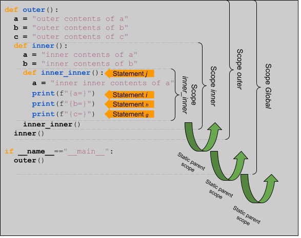
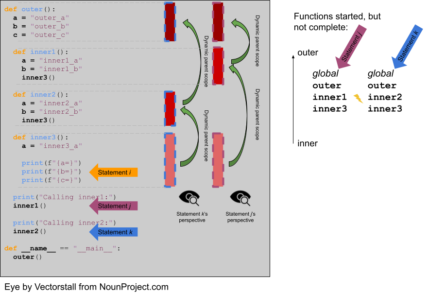

## Variables - Scope

In an effort to raise profit margin and satisfy increasingly restless investors, including activist [William Joy](https://en.wikipedia.org/wiki/Bill_Joy), [Prolog & Gradle](http://us.pg.com) have decided to divest their oral care products, including their world-famous mouthwash. The market cheered the decision with the stock rising 5% in after hours trading.

### Scope
_Scope_ is the range of statements in which a certain name can be used to access (for either reference or assignment) a variable. Using the vocabulary of bindings, _scope_ can also be defined as the collection of statements which can access a name binding. In other words, scope plays a role in determining the binding of a name to a variable.

Again, the point of studying scope is to help us to understand how we can determine the variable to which an identifier refers in a program.

It is easy to get fooled into thinking that a variable's name attribute is somehow intrinsic to the variable. However, a variable's name is just another attribute bound to a variable (like address, storage, value, etc) that may change throughout program execution. So, then, how is the binding between name and variable done? When is it done?

Before we get started answering those questions, it helps to think about in-scope variables in one of two different types of scopes: _local_ and _non-local_.

* local: A variable is _locally scoped_ to a unit or block of a program if it is declared there. From within that unit or block of code, the programmer can refer to that variable using the name of its declaration. Though not entirely synonymous, because the phrase "unit or block of a program" is so cumbersome, we will play a little fast and loose with the definition of scope and use the terms block and unit interchangeably. To be clear, no matter which term we use, when we say block or unit we are referring to the part of the program where names are _uniquely_ mapped to variables. In other words, in a block, it is not possible to have the same name refer to two different variables[^scope]. In C++ such a region is defined by `{`s and `}`s. In Python, such a region is defined by function and class definitions and a variable that is the subject of an assignment in a block is considered local to that block. For instance, in

[^scope]: This does _not_ preclude the possibility that one of those unique mappings _shadows_ (or hides) a different unique mapping. Read on for more about nested scopes.

```Python
def add(a, b):
  total = a + b
  return total
```

`total` is a local variable. In C++, a variable is local to the part of the source code beginning at the variable's declaration and continuing through the the `}` that matches the most recent `{`. Yes, I know that's way more complicated than it needs to be, but it's accurate. It is easier to simplify slightly and say that a variable is local to the part of the source code between the most closely nested `{` and its matching `}`. For instance, in

```C++
#include <iostream>
 
int main() {
  int a{0};

  if (a == 0) {
    int b{0};
  }
}
```

`b` is local to the source code between the `{` and `}`s of the if statement. `a` is local to the scope between the `{`  and `}` that delimit the body of the `main` function.

If the only variables to which we could refer by name in a programming language were the ones that were locally scoped, then our discussion could end here. We would not need any special rules for determining the variable to which a name refers -- remember, in a scope names have to be unique! 

However, most languages give the programmer the ability to create overlapping (or nested) scopes. With such power comes additional complexity.

* non-local: A variable is non-local if it can be accessed (again, through reference or assignment) but is not local.

Obviously it would be great if we could refer to a variable whose local scope encompasses the scope where we are writing a particular statement. To accomplish this feat, we will need to set down some rules to determine how to navigate overlapping scopes to find the local scope of the name being used.

First, by definition, if the programmer references the name of a local variable, the binding can be determined relatively easily. However, it gets interesting if the programmer refers to the name of a non-local variable.

Here is _the_ most common algorithm for performing the resolution of the binding between a variable and a name. The process described by this algorithm is known as _scope resolution_. The algorithm is described with respect to a statement, $s$. Think of $s$ as the statement that uses the name to be resolved (which we will refer to as $x$):

1. If $x$ names a local variable, $x$ is bound to that variable.
2. Otherwise, $x$ does not name a local variable. Consider the parent scope of $s$, $p$.
3. If the parent scope $p$ contains a local variable named $x$, $x$ is bound to that variable.
4. If the name $x$ is still not bound to a variable, consider the parent scope of $p$, $p'$. Continue searching parent scopes until there are no more ancestor scopes.

The algorithm is relatively straightforward, right? All that formalism reflects our intuition that we resolve name to variable bindings by looking for the declaration of the name beginning as close to the point of its use as possible and then continuing to work outward.

Well, yes! 

But, our algorithm seems more like a wish than a real algorithm -- something like saying that 

1. Determine a way to get rich. 
2. Profit

is an algorithm for early retired. There are some details left to work out. As for the scope resolution algorithm, it seems like we have left out a definition of what, exactly, is _parent scope_ and what are _ancestor scopes_? There are not one, but two answers!

#### Static Scoping

_Static scoping_, also known as _lexical scoping_ is a policy where parent and ancestor scopes are defined in a way that the binding of a name to a variable can be determined using only the program's source code. The parent scope (using our slightly loose definition of scope here [see above]) of a statement $s$ is the unit/block of a program that declared the unit/block of the program that contains $s$.

Statically scoped languages are the kind of languages that we are used to! The way that they perform scope resolution is so natural it almost seems uninteresting to discuss the algorithm!

However, here is an example to consider just to make sure that we are on the same page.

```Python
def outer():
  a = "outer contents of a"
  b = "outer contents of b"
  c = "outer contents of c"
  def inner():
    a = "inner contents of a"
    b = "inner contents of b"
    def inner_inner():
      a = "inner inner contents of a"
      print(f"{a=}")
      print(f"{b=}")
      print(f"{c=}")
    inner_inner()
  inner()  
if __name__=="main":  
  outer() 
```



When _Statement i_ is encountered statically, the algorithm for resolving the binding between name $a$ and a variable proceeds as follows:

1. $a$ is a local variable. The name is bound to the local variable.

Pretty easy, right?

Now, what happens when the statement after _Statement i_ is encountered statically and the binding between $b$ and a variable needs to be resolved?

1. $b$ is not a local variable.
2. Resolution proceeds to search the static parent of _Scope inner_inner_ for a local variable named $b$.
3. _Scope b_ does contain a local variable named $b$. The name is bound to that local variable.

Just what we expected!

And, finally, what happens when the binding between the name $c$ and a variable needs to be resolved?

1. $c$ is not a local variable.
2. Resolution proceeds to search the static parent of _Scope inner_inner_ for a local variable named $c$.
3. _Scope inner_inner_ does not contain a local variable named $c$.
4. Resolution proceeds to search the static parent of _Scope inner_inner_ for a local variable named $c$.
5. _Scope outer_ does contain a local variable named $c$. The name is bound to that local variable.

Lots of work, but largely as expected! Given that, the program prints what we would expect:

```Python
a='inner inner contents of a'
b='inner contents of b'
c='outer contents of c'
```

**Consider this ...**
Python and C++ have different ways of creating scopes. In Python and C++, a new scope is created at the beginning of a function definition (and that scope contains the function's parameters automatically). However, Python and C++ differ in the way that scopes are declared (or not!) for variables used in loops. Consider the following Python and C++ code (also available at [https://github.com/hawkinsw/cs3003/blob/main/scope_lifetime/loop_scope.cpp](https://github.com/hawkinsw/cs3003/blob/main/scope_lifetime/loop_scope.cpp) and [https://github.com/hawkinsw/cs3003/blob/main/scope_lifetime/loop_scope.py](https://github.com/hawkinsw/cs3003/blob/main/scope_lifetime/loop_scope.py)):

```Python
def f():
  for i in range(1, 10):
    print(f"i (in loop body): {i}")
  print(f"i (outside loop body): {i}")  
```

```C++
void f() {
  for (int i = 0; i<10; i++) {
    std::cout << "i: " << i << "\n";
  }  
// The following statement will cause a compilation error  
// because i is local to the code in the body of the for   
// loop.   
// std::cout << "i: " << i << "\n";  
} 
```

In the C++ code, the `for` loop introduces a new scope and `i` is in that scope. In the Python code, the `for` loop does not introduce a new scope and `i` is in the scope of `f`. Try to run the following Python code (also available at [https://github.com/hawkinsw/cs3003/blob/main/scope_lifetime/loop_scope_error.py](https://github.com/hawkinsw/cs3003/blob/main/scope_lifetime/loop_scope_error.py)) to see why this distinction is important:

```Python
def f():
  print(f"i (outside loop body): {i}")
  for i in range(1, 10):
    print(f"i (in loop body): {i}")
```

#### Dynamic Scoping
Static scoping is what we have grown up with, so to speak, as programmers. We are so used to it that it almost seems like the _only_ way to do scope resolution! And yet, there is another way!

_Dynamic scoping_ is the type of scope resolution policy where the binding between a name and a variable can only be determined during program execution. In a dynamically scoped programming language, determining the name/value binding is done iteratively by searching through a block's nested _dynamic parents_. The _dynamic parent_ of a block is the block from which the current block was _executed_. Very few programming languages use dynamic scoping (BASH, Perl [optionally]) because it makes checking the types of variables difficult for the programmer (and impossible for the compiler/interpreter) and because it increases the "distance" between name/variable binding and use during program execution. However, dynamic binding makes it possible for functions to require fewer parameters because dynamically scoped non-local variables can be used in their place. We will learn more about this latter advantage when we discuss closures during our exploration of functional programming languages.

The concept of _dynamic parents_ has a close connection with _activation records_ (a.k.a. _stack frames_) and the _runtime stack_ which we will study in a few lessons. In the meantime, let's assume that Python is a dynamically scoped language and decipher the output of the same program as above:

```console
Calling inner1:
a='inner3_a'
b='inner1_b'
c='outer_c'
Calling inner2:
a='inner3_a'
b='inner2_b'
c='outer_c'
```


How does this work? What happens when _Statement i_ is encountered at runtime and the binding between $b$ and a variable needs to be resolved?

1. $b$ is not a local variable.
2. Resolution proceeds to search the dynamic parent of _Statement i_ for a local variable named $b$. Depending on whether `inner3` was called from `inner2` or `inner1`, the next scope to be searched will be different.
3. If `inner3` was called from `inner1` (_Statement j_), then the scope of that function is searched for a local variable named $b$. Success! $b$ is bound to a local variable whose contents are `"inner1_b"`.
4. If `inner3` was called from `inner2` (_Statement k_), then the scope of that function is searched for a local variable named $b$. Success! $b$ is bound to a local variable whose contents are `"inner2_b"`

That's amazing! It is not _that_ different from static scope resolution but gives us so much more flexibility. That's what is so neat about programming languages: A small tweak to one particular part of the language can give us the opportunity to think very differently about the way that programs are structured.

### Referencing Environment - A Scope-related Concept

The referencing environment of a statement contains all the name/variable bindings visible at that statement. NOTE: The examples in the book on pages 223 and 224 are absolutely horrendous -- disregard them entirely. Consider the example online here: [https://github.com/hawkinsw/cs3003/blob/main/scope_lifetime/referencing_environment.py](https://github.com/hawkinsw/cs3003/blob/main/scope_lifetime/referencing_environment.py). Play around with that code and make sure that you understand why certain variables are in the referencing environment and others are not. 

In case you think that this is theoretical and not useful to you as a real, practicing programmer, take a look at the official documentation of the Python execution model and see how the language relies on the concept of referencing environments: [https://docs.python.org/3/reference/executionmodel.html#naming-and-binding](https://docs.python.org/3/reference/executionmodel.html#naming-and-binding). Pretty cool!!