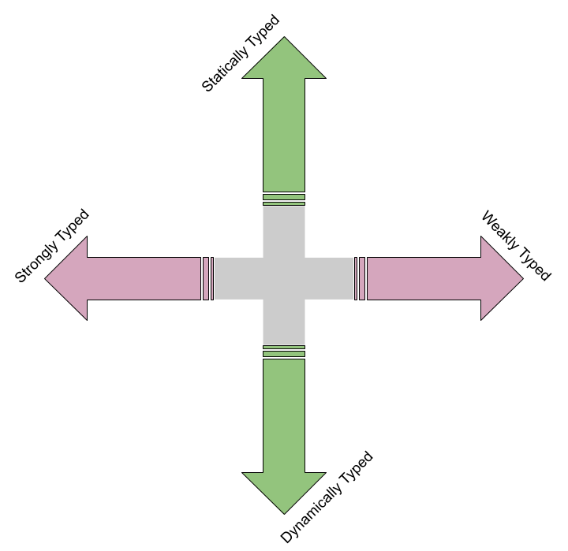

## What's News

A company specializing in finding actors to portray programmers in movies and on TV had a successful IPO today. Type Casting's shares rose 35% in their first day on the market.

## Just My Type

Although engaging in a discussion about the importance of types in a programming language with PL researchers and aficionados is sure to lead to a heated conversation, there is nothing controversial about variables having an associated type, _per se_. With the advent of modern high-level languages (In an academic article about the history of early programming languages, Don Knuth wrote that Zuse's Plankalkul was one of the first languages whose variables had associated types -- at least in a way that would be recognizable to us![^history]), programmers gained the ability to specify, with precision, the valid values that a variable could hold and the valid operations a programmer could perform on those values. In other words, the programmer gained the power to specify the _type_ of a variable.

[^history]: Knuth Donald E. and Pardo Luis Trabb. 1980. The Early Development of Programming Languages. In A History of Computing in the Twentieth Century , Jack Howlett, Nicholas Metropolis and Gian-Carlo Rota (eds.). Academic Press, New York, 197–273.

Furthermore, just to be sure that _type_ doesn't run off on an ego trip, it is important to remember that the association between type and variable is a _binding_ just like the 5 other attribute-entity bindings that apply to variables. Given that a variable's type is just one of the variable's bindings, then we can conclude that the time those bindings are made can be differentiated depending on whether the association is made statically or dynamically.

In a minute we will discuss the ways that programming language designers can specify that programmers write code to specify the binding between types and variables. But, before we do that, let's answer the question, "What good are types?"

Variable types are useful parts of programming languages because they allow the language (and its associated tools) to help us programmers write correct code. The key, of course, is _help_. Associating types with variables in languages like C, C++, Python, etc. give the language a way to check that we are writing code that makes meaningful use of variables. How does it do that? Well, it assumes that if we modify variables using operations from within its type's set of valid operations, then we are not doing anything _obviously_ wrong. Of course, we can always use a sequence of valid operations to end up with a variable whose value is nonsense (e.g., dividing an integer by 0), but it's definitely _easier_ to generate those nonsense values when we are free to perform operations on those values that are not in their set of valid operations (e.g., dividing a string by a floating-point number).

A language's ability to check that its users manipulate the value's of variables _meaningfully_ implies that languages have a set of rules for making that assessment. A _type system_ helps a language's compiler/runtime to make the "decision about whether it is OK to run a program ... according to the [set of type] rules."[^ramsey] A language's type rules determine what are considered "meaningless operations"[^ramsey] and "determine ... what the type is"[^ramsey] of an expression. A type system also determines whether and how two (or more) types is equivalent or compatible.[^sebesta]

When a compiler/runtime determines that you have attempted to perform a meaningless operation, it may issue a _type error_. A language's type system is considered _sound_ if expressions in a program that passes all the language's type checks contain only valid values (according to its type).[^ramsey] A language that _always_ detects type errors (whether before the program executes or while the program executes) is considered _strongly typed language_. A language that does _not_ always detect type errors is considered a weakly typed programming language. 

> **Note**: The difference between a strongly and weakly typed language depends only on whether the language detects all type errors and not _when_ it detects those errors.

[^ramsey]: Ramsey, N. (2022). Programming languages: Build, prove, and compare. Cambridge University Press.

[^sebesta]: Sebesta, R. (2020). Concepts of programming languages (12th ed.). Pearson.


## Statically Typed Language

In a statically typed programming language, the variable-type binding is made before the program executes and does not change throughout the entirety of program execution. That should not be a surprising statement given what we know about "the first 5" binding times and the definition of _static binding_s.

Common examples of statically typed programming languages are C++, Rust, Go, and Java.

## Dynamically Typed Language

On the other end of the spectrum are dynamically typed programming languages. A dynamically typed programming language is one whose variable-type association is made at runtime _or_ is made before runtime and may change throughout the program execution. Again, that statement should make sense given what we know about binding times.

Common examples of dynamically typed programming languages are Python, Ruby, and JavaScript.

With that distinction (and the one made earlier between languages that are strongly or weakly typed), we can make a map on which every language can be placed according to how it handles types. That the arrows on the map point $90\degree$ from one another should indicate that strongly/weakly typed determination is _orthogonal_ to the statically/dynamically typed determination.



## Associating Types With Variables

Whether variables are given types statically or dynamically, every language has a process of making that association. The associations between type and variable can be made _explicitly_ or _implicitly_.

### Explicit

When we, the tired programmer, are forced to expend what little energy we have in our fingers to type out the type (get it?) of each and every variable that we declare, we are working in an _explicitly typed_ language. Until very recently, C++ was exclusively explicitly typed (see below for the _new_ thing in C++):

```C++
int main() {
    int x{0};
    int y{0};
    double z{0.0};
    return 0;
}
```

Notice how we had to explicitly label the types for each of the three variables. I am so tired.

### Implicit

If we are following best practices and always initializing our variables when they are declared, then we are already giving the compiler an example of one of the valid values of a particular type to assign to a variable. If that initial value can be a member of the set of valid values of only one of the language's types, why do we need to repeat ourselves to the language (either the compiler or the interpreter) and explicitly label the variable's type? 

#### Inference
In some implicitly typed programming languages, the types are _inferred_ from the code and we don't have to repeat ourselves! Consider this snippet of Go:

```Go
type Internet struct {
    // some fields here.
}

func main() {
    could := Internet{}
}
```

The `:=` is shorthand in Go for "declare a variable and give it some initial contents". In the case above, we are telling Go to declare a variable named `could` and give it the initial assignment of an instance of the `Internet` data structure. Go can look at the type of the expression defining the variable's initial value and _infer_ the type of the variable we are declaring. We don't have to type it again! That's awesome!

Think back to what you know about C++ ... is there a modern(ish) keyword in the language that gives it "implicit powers"? That's right, the `auto` keyword:

```C++
int main() {
    auto name{std::string{"Derek"}};
    return 0;
}
```

Because we are initializing `name` with an expression whose type is `std::string`, the compiler is smart enough to infer that we are declaring a string!

Even in dynamically typed languages, types can be bound to variables through inference. Consider this snippet of Python:

```Python
from bintrees import BinaryTree

class Address():
    def __init__(self, street: str):
        self.__street = street

if __name__ == "__main__":
    pine = Address("349 Pine Dr.")
    pine = BinaryTree()
    print("")
```

The type of `pine` is inferred from the type of the expression used to update its value. The first assignment to `pine` not only changes the value of `pine` but it also changes the type (to `Address`). The second assignment does something similar: it changes the value of `pine` and the type (to `BinaryTree`).

> Note: You can use the built-in function named `type` in Python to determine the type of a variable when the program is executing. For instance,

```Python
from bintrees import BinaryTree

class Address():
    def __init__(self, street: str):
        self.__street = street

if __name__ == "__main__":
    pine = Address("349 Pine Dr.")
    print(f"I live at {type(pine)}")
    pine = BinaryTree()
    print(f"I climb {type(pine)}-s")
    print("")
```
> will print

```
I live at <class '__main__.Address'>
I climb <class 'bintrees.bintree.BinaryTree'>-s
```

#### By Convention

And now for something weird and wild. There are certain modern languages that do not have types (in the strictest sense of the term). That makes it very difficult for programmers to determine whether their use of a variable is legal. One option when faced with this challenge is to write code that "gives" types to variables by convention on the way that variables are named. 

The earliest example of such a convention-for-types-according-to-names was in the original Fortran: As _Sebesta_ says:

> There were no data-typing statements in the Fortran I language. Variables whose names began with `I`, `J`, `K`, `L`, `M` and `N` were implicitly integer type, and all others were implicitly floating-point.

In a case of What's Old Is New Again, [Charles Simonyi](https://en.wikipedia.org/wiki/Charles_Simonyi), a famous developer at Microsoft settled on a convention for naming variables that eventually became known as [Hungarian Notation](https://en.wikipedia.org/wiki/Hungarian_notation). Even though programmers at Microsoft now all use languages with data types, the Hungarian Notation convention persists in the code for the Windows operating system and the API. In Hungarian notation, the type of the variable is prepended to the name of the variable. If we used Hungarian Notation to keep track of variable names in JavaScript, we might write code that looks like:

```JavaScript
var fHappy = true;

if (fHappy == true) {
    szLocation = "PL Class"
} else {
    szLocation = "Calculus I"
}
```

The `f` prepended to `Happy` is Hungarian Notation for a _flag_ variable and the `sz` prepended to the `Location` variable stands for a _string_.[^msdn][^msdn2]

[^msdn]: Microsoft. 2020. Coding Style Conventions - Win32 apps. Microsoft.com. Retrieved October 2, 2025 from https://learn.microsoft.com/en-us/windows/win32/stg/coding-style-conventions

[^msdn2]: Charles Simonyi. 1999. Hungarian Notation. Microsoft. Retrieved October 2, 2025 from https://learn.microsoft.com/en-us/previous-versions/visualstudio/visual-studio-6.0/aa260976(v=vs.60)?redirectedfrom=MSDN

When a programmer is working in a code base that uses Hungarian Notation and thought that the location variable was designed to hold GPS coordinates, they might write the following assignment statement:

```JavaScript
szLocation = { 'latitude': 84, 'longitude': 51 }
```

Immediately after writing that code they would realize they are in a heap of trouble -- a JavaScript object (which is written here between the `{` and `}`) is not a string and they could see their mistake thanks to the `sz` prefix!