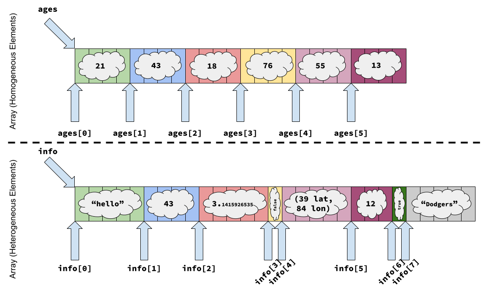

### What's News

Black and Type Checker, the popular tool maker, is in talks to combine with Texas Imperatives to create a brand new company that sells both power tools and programming tools. The companies have described cost efficiencies from the combination and believe that they will be able to build better corporate human resources codes, for instance. It could rival the private-equity purchase of EA as the largest leveraged buyout in history. As part of their announcement, they said that they chose "The Right Tool For The Job" as their slogan.

### The Right Tool For the Job

Just like there is the right tool for every job, there is a "right" type for every variable. Of course you all remember the definition of _type_ (the range of valid values for a variable and the set of valid operations on those values) but just why are types important? Types are useful pieces in programming languages because they allow the language (and its associated tools) to help us programmers write correct code. The key, of course, is help.

> There are languages where you can actually do all your computations _using types_. In these languages, some theorists argue that if your program is accepted by the "compiler", then the program is provably correct. We will discuss these arguments (and others) when we talk about semantics of programs.

Associating types with variables in languages like C, C++, Python, etc. give the language a way to check that we are are writing code that makes meaningful use of variables. How does it do that? Well, it assumes that if we modify variables using operations from within its type's set of valid operations, then we are not doing anything _obviously_ wrong. Of course, we can always use a sequence of valid operations to end up with a variable whose value is nonsense (e.g., dividing an integer by 0), but it's definitely _easier_ to generate those nonsense values when we are free to perform operations on those values that are not in their set of valid operations (e.g., dividing a string by a floating-point number).

Given how helpful it is to bind variables with types, it should be clear that choosing the right type will help us programmers even more. In order to choose the right type, we'll need to know the types that are usually available to help us organize our data.

#### A Primal Urge

Before discussing individual types by name and talking about their characteristics, let's discuss how we can divide types into two broad categories. The first category are known as _primitive variable_ types. These are variable types that are "built into" the language. To the programmer using the language, they appear to be atomic -- the programmer cannot break apart the values of variables that have these types; the programmer uses the entire value or none of the value at all. In many programming languages, the values of primitive variables map directly to pieces of data that the underlying computer hardware knows how to use. For instance, the type that represents whole numbers is usually a primitive in a programming language. Other examples of primitive types include boolean variables, floating-point variables and character variables.

On the other hand, languages have _aggregate-typed_ variables. Whereas a value with a primitive type cannot be broken apart, a variable with an aggregate type can be pieced apart. An aggregate type is composed of values of one or more other types -- primitive or aggregate. The ability to make aggregate types that include values of either primitives or other aggregate types gives the programmer all the power that they need to create a type to model almost any type of data that they need to model in their application. 

I think that is fascinating -- such a small design decision (including in the programming language the ability to compose types in other types) gives the programmer an infinite amount of control and power to customize.

Just what are some of the most common styles of aggregate types?

#### Arrays

Arrays are one of the aggregate data types that are most familiar to programmers. They are so commonly used that we sometimes take them for granted. We cannot do that, however, because a language's choices about how to implement arrays can play a huge role in how fast code runs that uses array-typed variables.

In particular, arrays are a homogeneous data type. In other words, they require that each of their elements be of the same type. In order to access the individual elements of an array-typed variable, the programmer uses an _index_. The index is sometimes referred to as a _subscript_. An array holds a certain number of elements (usually set by the programmer at the time the variable is declared) and it is only correct to access elements of an array using an index between $0$ and that value. Each of the elements of an array are positioned consecutively in the computer's memory.

One of the tradeoffs in the implementation of arrays in a programming language is the designer's choice about whether the sizes of an array will be dynamic or static (there are those words again!). If the array's size (an _attribute_) is static, then ... well, I'll let you fill in that blank. In the case of a language whose array's are statically sized, when a program written in that language is executing, there is really no need for the array to "carry around" its size. The language's compiler or interpreter should have been able to build a representation of the program before execution where that size is fully incorporated into the representation (because it never changes when the program is executing!). The choice, then, for a language to have statically-sized arrays means that there is likely a performance improvement in programs that use arrays written in that language.

> Note: There is no requirement that programming languages with statically-sized arrays perform this type of optimization, but they _usually_ do.

If the language's arrays are not statically sized, the only other reasonable option is that they are dynamically sized. In a language with dynamically sized arrays, a variable with an array type must be associated with a place in memory (over and above the space required to hold the values) to keep track of its size. In these types of languages, that usually means that arrays have a performance penalty given their additional usage of space.

One benefit of a language with dynamically-sized arrays is that it is possible for the code generated by the compiler for that language (or the language's interpreter) to check to make sure that array accesses are done using safe indexes -- indexes that are within the array's size. That's a really powerful safety feature. However, that does not come without a price: each array access can only proceed once the safety of the access is checked. As you can tell, these are not easy choices for a language designer to make.

The homogeneity requirement for an array also has performance implications. Why isn't possible for arrays to hold elements of different types? One of the benefits of using an array is that it is a _random-access aggregate data type_. That means that accesses to _any_ of the elements in that aggregate can be done in the same amount of time as any other. Or, to say it another way, if there is an array of `int`s in C++ that holds the values of everyone's age in the class (named `ages`), then the values at

```C++
ages[0]
```

and 

```C++
ages[4]
```

take the same amount of time to access.[^access-roughly-speaking]

How does this work? Well, it all relies on the fact that each of the elements in the array is of the same type. Part and parcel with reading the value of a variable (or writing a value to a variable) is calculating its address in memory. So, before we can even start the operation of reading the two values from the `ages` array, we have to calculate their addresses.

In a language like C (or C++), variables that have array types are really nothing but pointers to the first element in the array. So, to calculate the address of `ages[0]`, our job is pretty much done: just refer to the address in `ages`. But, what about `ages[4]`? Look at the top part of the image below for a (relatively faithful -- check out [this](https://godbolt.org/z/Kcq1x4Wsd) code if you don't believe me!) representation of how an array in C/C++ would be stored in memory. Assuming that we can use [`sizeof(`$`{X}`$`)`](https://en.cppreference.com/w/cpp/language/sizeof.html) to get (at compile time) the size (in memory in bytes) of a type $X$, to get from `ages` to `ages[4]` would require advancing `4*sizeof(int)` bytes from `ages`. What about if we wanted `ages[2]`? To get from `ages` to `ages[2]` would require advancing `2*sizeof(int)` . In other words, no matter what $i$ the programmer writes in `ages[`$i$`]`, calculating the address of that variable in memory requires no more than a simple multiplication and addition! No wonder it takes the same amount of time to get/set any element in an array![^pointer-arithmetic]

Generally, calculating the address of an element at index $y$ of an array of elements that have type $T$ whose name is `ar` can be done like

`ar` $+ y*$`sizeof(`$T$`)`

What if arrays could hold elements of different types, like in the bottom of the figure shown below? Could we do that same trick? Obviously not! The size (in memory in bytes) of the string in the first element is not the same as the size of the floating-point number in the third element -- if we used the formula above to calculate the address of `info[3]` ... well, it wouldn't even make sense. Instead, to find the address of a given element, the compiler (or runtime) would have to generate code that (or execute) steps through each element, skipping to the next element only after inspecting the type of the current element. That seems less like an array and more like a linked ... okay, I won't say it!



[^pointer-arithmetic]: Yes, those calculations _are_ what the code generated by a C/C++ does, but do _not_ write that in your program until you understand [_pointer arithmetic_](https://en.cppreference.com/w/cpp/language/operator_arithmetic.html). Otherwise you will get some very fishy results.

[^access-roughly-speaking]: Yes, there will be reasons why accessing one could be faster than another (cache effects, etc.), but generally speaking ...

Without context, the decision of a language's designers to require that each element in an array have the same type seems arbitrary. However, when we look at the same decision in terms of the goal of making access to each element a constant-time operation, that restriction seems reasonable.

#### Associative Arrays

Associative arrays are very similar to arrays. There are two differences. First, access to individual elements is not (usually) guaranteed to be a constant-time operation. Second, and more interesting, the "indexes" used to access individual elements in an associative array are not limited to numbers. The indexes of an associative array can be any type (with some restrictions).

Associative arrays are also known as dictionarys or hash tables. For example, in Python, the associative array is known as a dictionary and is one of the workhorse data types in the language:

```Python

def use_or_lose(team): 
    stats = {}
    stats['celtics'] = 18
    stats['reds'] = 5
    stats['suns'] = 0
    return stats[team]

if __name__=="__main__":
    print(f"The Cincinnati Reds have won {use_or_lose('reds')} championships")
```
Pretty neat!

#### Records

No, not the vinyl records that are having a [massive comeback](https://www.theverge.com/2024/3/26/24112369/riaa-2023-music-revenue-streaming-vinyl-cds-physical-media). These records are another aggregate data type. The record shares with tuples that it can contain items of different types; the record shares with arrays that the individual elements can be randomly accessed; the record shares with dictionaries the use of non-numeric indexes for accessing individual elements in the aggregate. Woah. That's lots of capabilities.

In the C and C++ programming languages, records are typically spelled `struct`. As an example, let's say that we were interested in modeling the forecast for a particular day. Forecasters love to talk about how the day will be overall and give us the high and low temperature. We could model the forecast using a string to describe the day overall (`overall`) and two floating-point numbers to represent the high and the low temperatures:

```C++
struct Forecast {
    std::string overall;
    double high;
    double low;
};
```

If we had an _instance_ of a variable with that type, we know that the variable contains _all_ three of those different values _simultaneously_. To access the individual elements, we use their name (confusingly called the _index_ -- just like arrays):

```C++
int main() {
    Forecast tomorrow{};

    tomorrow.overall = std::string{"Nice"};
    tomorrow.high = 96.0;
    tomorrow.low = 76.0;
}
```

#### Conclusion

Types in programming languages are a huge boon for programmers. The type of a variable gives the language power to help us write correct programs by increasing the chances that we will only write code that operates on data in meaningful ways. Types can be broadly categorized as _primitive_ or _aggregate_. Values of variables with a primitive type are indivisible -- programmers cannot pick apart values of variables with primitive types into subcomponents. Aggregates, on the other hand, are data types that contain other data types -- either primitive or aggregate. Knowing the types that are common to most programming languages makes it easy to transition from language to language and help makes it easier to pick the right data model for a particular application.
